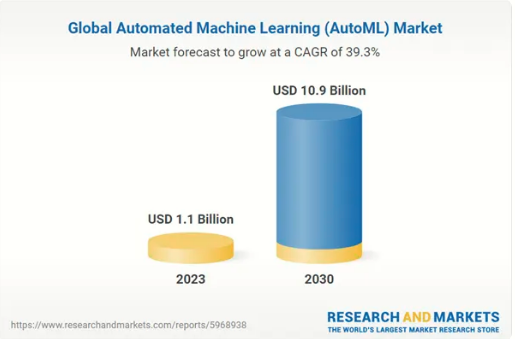
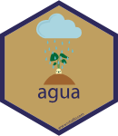

***DATA SCIENCE, ARCHITECTURE, AI & ML Part 3*** **:** Continuing with the Higgs Boson Machine data set, we will train a machine learning (ML) model to automatically classify Higgs Boson events from others (such as background noise) generated from simulated proton-proton collisions in CERN’s Large Hadron Collider. The data can be obtained directly from CERN. Lets have ago at it!

<div>

**Series Description**

This series is an overview on aspects Data Science, AI, & ML presented in HTML format with code embedded within. Any audience could grasp understanding from this presentation, and is intended to be helpful for a variety of different purposes. Having said the above please note this implementation features a modern multi-lingual approach & to understand the ins and outs of coding particulars inherently requires expertise in that particular domain. Part 2 features R, Python, Julia, Java, Scala & SQL. In addition CPU, and parallel (CPU, GPU) computational architectures are implemented through wrappers to C, C++, & Cuda code. Their is a focus on opensource technologies, part 2 implements Plotly, Torch, h2o_ai, & Spark. Reproducible coding & data conventions have been implemented & the embedded code is well commented. Referencing is performed through html-links allowing for easy click & go sourcing. The series is available to all on Github, according to the platform licensing & conduct policies The data set for part 2 is the Atlas Higgs ML Data Set.

</div>

**Dublin, July 15, 2024 (GLOBE NEWSWIRE) -**- The ["Automated Machine Learning (AutoML) - Global Strategic Business Report"](https://www.researchandmarkets.com/reports/5968938/automated-machine-learning-automl-global?utm_source=GNE&utm_medium=PressRelease&utm_code=g3x4wf&utm_campaign=1978230+-+Global+Automated+Machine+Learning+(AutoML)+Business+Analysis+Report+2024-2030+with+Coverage+of+20%2b+Major+Players+Including+Altery%2c+Amazon+Web+Services%2c+and+Databricks&utm_exec=chdomspi) report has been added to **ResearchAndMarkets.com's** offering.\
\
The global market for Automated Machine Learning (AutoML) is estimated at US\$1.1 Billion in 2023 and is projected to reach US\$10.9 Billion by 2030, growing at a CAGR of 39.3% from 2023 to 2030. This comprehensive report provides an in-depth analysis of market trends, drivers, and forecasts, helping you make informed business decisions.

{width="725"}

**Key Insights:**

-   Market Growth: Understand the significant growth trajectory of the AutoML Solutions segment, which is expected to reach US\$5.6 Billion by 2030 with a CAGR of a 35.3%. The AutoML Services segment is also set to grow at 44.8% CAGR over the analysis period.

-   Regional Analysis: Gain insights into the U.S. market, estimated at \$291.9 Million in 2023, and China, forecasted to grow at an impressive 36.7% CAGR to reach \$1.5 Billion by 2030. Discover growth trends in other key regions, including Japan, Canada, Germany, and the Asia-Pacific.

## H2o Automated Machine Learning

Automated machine learning (AutoML) is the process of [automating](https://en.wikipedia.org/wiki/Automation "Automation") the tasks of applying [machine learning](https://en.wikipedia.org/wiki/Machine_learning "Machine learning") to real-world problems. It is the combination of automation and ML.[[1]](https://en.wikipedia.org/wiki/Automated_machine_learning#cite_note-1)

AutoML potentially includes every stage from beginning with a raw data set to building a machine learning model ready for deployment. AutoML was proposed as an [artificial intelligence](https://en.wikipedia.org/wiki/Artificial_intelligence "Artificial intelligence")-based solution to the growing challenge of applying machine learning.[[2]](https://en.wikipedia.org/wiki/Automated_machine_learning#cite_note-autoweka1-2)[[3]](https://en.wikipedia.org/wiki/Automated_machine_learning#cite_note-AutoML2014ICML-3) The high degree of automation in AutoML aims to allow non-experts to make use of machine learning models and techniques without requiring them to become experts in machine learning. Automating the process of applying machine learning end-to-end additionally offers the advantages of producing simpler solutions, faster creation of those solutions, and models that often outperform hand-designed models.[[4]](https://en.wikipedia.org/wiki/Automated_machine_learning#cite_note-4)

Common techniques used in AutoML include [hyperparameter optimization](https://en.wikipedia.org/wiki/Hyperparameter_optimization "Hyperparameter optimization"), [meta-learning](https://en.wikipedia.org/wiki/Meta-learning_(computer_science) "Meta-learning (computer science)") and [neural architecture search](https://en.wikipedia.org/wiki/Neural_architecture_search "Neural architecture search").

-   Choosing the best machine learning models and tuning them can be time consuming and exhaustive. Often, it requires levels of expertise to know what parameters to tune. The field of AutoML focuses on solving this issue. AutoML is useful both for experts, by automating the process of choosing and tuning a model; and for non-experts as well, by helping them to create high performing models in a short time frame. Some of the aspects of machine learning that can be automated include data preparation, which can include imputation, one-hot encoding, feature selection/extraction, and also feature engineering. Another aspect that can be automated is the model generation, which includes training a model and tuning it with cartesian or random grid search. Lastly, a third aspect that could be using ensembles, as they usually outperform individual models.

-   H2O AutoML is an automated algorithm for automating the machine learning workflow, which includes some light data preparation such as imputing missing data, standardization of numeric features, and one-hot encoding categorical features. It also provides automatic training, hyper-parameter optimization, model search, and selection under time, space, and resource constraints. H2O's AutoML further optimizes model performance by stacking an ensemble of models. H2O AutoML trains one stacked ensemble based on all previously trained models and another one on the best model of each family.

To enable the re usability of massive scientific data sets by humans and machines, researchers aim to adhere to the principles of find-ability, accessibility, interoperability, and re usability (FAIR) for data and artificial intelligence (AI) models.

<div>

**heir are 3 ways to h2o: i. - Local ii. - System iii. - Spark Based,**

H2O Open Source \| H2O.ai - <https://h2o.ai/platform/ai-cloud/make/h2o/>

This time we will perform a system connection: Via command prompt Launch h2o to taker advantage of the newest release of h2o (h2o_3.46.0.4) which is not ready for spark yet.

</div>

::: {style="color: orange;"}
C:/ProgramData/h2o-3.46.0.2/h2o-3.46.0.4\> java -jar h2o.jar

06:23:16.114 [main] WARN hex.tree.xgboost.XGBoostExtension - Cannot initialize XGBoost backend! Xgboost (enabled GPUs) needs: - CUDA 8.0 XGboost (minimal version) needs: - GCC 4.7+ Apple silicon is not supported yet For more details, run in debug mode: `java -Dlog4j.configuration=file:///tmp/log4j.properties -jar h2o.jar`

2024-07-17 06:23:16.883:<INFO::main>: Logging initialized @1733ms to org.eclipse.jetty.util.log.StdErrLog 07-17 06:23:17.973 192.168.1.19:54323

#2988 main INFO water.default: ----- H2O started ----- 07-17 06:23:17.975 192.168.1.19:54323

#2988 main INFO water.default: Build git branch: rel-3.46.0 07-17 06:23:17.976 192.168.1.19:54323

#2988 main INFO water.default: Build git hash: a24dd872beb239f3f8921820fc0c4bd9de3f8dd9 07-17 06:23:17.977 192.168.1.19:54323

#2988 main INFO water.default: Build git describe: jenkins-3.46.0.3-6-ga24dd872beb 07-17 06:23:17.978 192.168.1.19:54323

#2988 main INFO water.default: Build project version: 3.46.0.4 07-17 06:23:17.980 192.168.1.19:54323

#2988 main INFO water.default: Build age: 7 days, 10 hours and 11 minutes 07-17 06:23:17.981 192.168.1.19:54323

#2988 main INFO water.default: Built by: 'jenkins' 07-17 06:23:17.983 192.168.1.19:54323 \\

#2988 main INFO water.default: Built on: '2024-07-09 20:11:23' 07-17 06:23:17.984 192.168.1.19:54323

#2988 main INFO water.default: Found H2O Core extensions: [KrbStandalone, Infogram] 07-17 06:23:17.987 192.168.1.19:54323

#2988 main INFO water.default: Processed H2O arguments: [] 07-17 06:23:17.988 192.168.1.19:54323

#2988 main INFO water.default: Java availableProcessors: 48 07-17 06:23:17.990 192.168.1.19:54323

#2988 main INFO water.default: Java heap totalMemory: 2.00 GB 07-17 06:23:17.991 192.168.1.19:54323

#2988 main INFO water.default: Java heap maxMemory: 29.97 GB 07-17 06:23:17.992 192.168.1.19:54323

#2988 main INFO water.default: Java version: Java 11.0.2 (from Oracle Corporation) 07-17 06:23:17.993 192.168.1.19:54323

#2988 main INFO water.default: JVM launch parameters: [] 07-17 06:23:17.994 192.168.1.19:54323

#2988 main INFO water.default: JVM process id: [202988\@C-Cluster](mailto:202988@C-Cluster){.email} 07-17 06:23:17.997 192.168.1.19:54323

#2988 main INFO water.default: OS version: Windows Server 2016 10.0 (amd64) 07-17 06:23:18.000 192.168.1.19:54323

#2988 main INFO water.default: Machine physical memory: 207.80 GB 07-17 06:23:18.005 192.168.1.19:5432

#2988 main INFO water.default: Listening for HTTP and REST traffic on <http://192.168.1.19:54323/> 07-17 06:23:18.656 192.168.1.19:54323

#2988 main INFO water.default: H2O cloud name: 'Administrator' on /192.168.1.19:54323, discovery address /233.190.242.173:59838 07-17 06:23:18.657 192.168.1.19:54323

#2988 main INFO water.default: If you have trouble connecting, try SSH tunneling from your local machine (e.g., via port 55555): 07-17 06:23:18.661 192.168.1.19:54323

#2988 main INFO water.default: 1. Open a terminal and run 'ssh -L 55555:localhost:54323 [Administrator\@192.168.1.19](mailto:Administrator@192.168.1.19){.email}' 07-17 06:23:18.662 192.168.1.19:54323

#2988 main INFO water.default: 2. Point your browser to <http://localhost:55555> 07-17 06:23:20.101 192.168.1.19:54323

#2988 main INFO water.default: Using HDFS configuration from C:/Users/Administrator/AppData/Local/spark/spark-3.5.0-bin-hadoop3/temp/hadoop/conf 07-17 06:23:20.208 192.168.1.19:54323

Hadoop home directory C:\Users\Administrator\AppData\Local\spark\spark-3.5.0-bin-hadoop3\temp\hadoop

#2988 main INFO water.default: Log dir: '\tmp\h2o-Administrator\h2ologs' 07-17 06:23:20.230 192.168.1.19:54323

#2988 main INFO water.default: Cur dir: 'C:\ProgramData\h2o-3.46.0.2\h2o-3.46.0.4' 07-17 06:23:20.247 192.168.1.19:54323

#2988 main INFO water.default: Subsystem for distributed import from HTTP/HTTPS successfully initialized 07-17 06:23:20.248 192.168.1.19:54323

#2988 main INFO water.default: HDFS subsystem successfully initialized 07-17 06:23:20.256 192.168.1.19:54323

#2988 main INFO water.default: S3 subsystem successfully initialized 07-17 06:23:20.277 192.168.1.19:54323

#2988 main INFO water.default: GCS subsystem successfully initialized 07-17 06:23:20.278 192.168.1.19:54323

#2988 main INFO water.default: Drive subsystem not available 07-17 06:23:20.281 192.168.1.19:54323

#2988 main INFO water.default: Flow dir: 'C:/Users/Administrator/h2oflows' 07-17 06:23:20.730 192.168.1.19:54323

#2988 main INFO water.default: Cloud of size 1 formed [/192.168.1.19:54323] 07-17 06:23:20.734 192.168.1.19:54323

#2988 main INFO water.default: Registered REST API extensions: [Mojo 2 pipeline extensions, Amazon S3, Algos, Infogram, AutoML, Core V3, TargetEncoder, Core V4] 07-17 06:23:21.393 192.168.1.19:54323

#2988 main INFO water.default: Registered: 332 schemas in 171ms 07-17 06:23:21.394 192.168.1.19:54323

#2988 main INFO water.default: H2O started in 5872ms 07-17 06:23:21.397 192.168.1.19:54323

#2988 main INFO water.default: 07-17 06:23:21.398 192.168.1.19:54323

#2988 main INFO water.default: Open H2O Flow in your web browser: <http://192.168.1.19:54323> 07-17 06:23:21.399 192.168.1.19:54323

#2988 main INFO water.default: 07-17 06:40:41.070 192.168.1.19:54323

#2988 9782425-31 INFO water.default: POST /99/Rapids, parms: {ast=(rm RTMP_sid_a390_5), session_id=\_sid_a390} 07-17 06:40:41.077 192.168.1.19:54323

#2988 FJ-1-15 INFO water.default: Locking cloud to new members, because water.rapids.Session\$1 07-17 06:40:41.211 192.168.1.19:54323

#2988 9782425-27 INFO water.default: POST /99/Rapids, parms: {ast=(rm RTMP_sid_a390_3), session_id=\_sid_a390} 07-17 06:43:54.315 192.168.1.19:54323

#2988 9782425-29 INFO water.default: POST /99/Rapids, parms: {ast=(rm RTMP_sid_a390_6), session_id=\_sid_a390} 07-17 06:43:54.339 192.168.1.19:54323

#2988 9782425-34 INFO water.default: POST /99/Rapids, parms: {ast=(rm RTMP_sid_a390_4), session_id=\_sid_a390}
:::

## h2o Initialize {style="color: lightblue;"}

With the Higgs Boson ML data set, we will automate the creation of many machine learning (ML) model(s) to automatically classify Higgs Boson events from others (such as background noise) generated from simulated proton-proton collisions in CERN’s Large Hadron Collider. The data can be obtained directly from CERN. Lets have ago at it!

```{r Auto_ML}
# install.packages('C:/ProgramData/h2o-3.46.0.2/h2o-3.46.0.4/R/h2o_3.46.0.4/h2o_3.46.0.4.tar',

library(h2o);library(h2otools)
h2o.init(  ip = "127.0.0.1",
           port = 54327,
           startH2O = FALSE)
 
# Import a sample binary outcome train/test set into H2O
train <- 
  h2o.importFile("https://s3.amazonaws.com/erin-data/higgs/higgs_train_10k.csv" ,  header = TRUE, destination_frame = "train")

test <- 
  h2o.importFile("https://s3.amazonaws.com/erin-data/higgs/higgs_test_5k.csv" ,  header = TRUE, destination_frame = "test")

summary(train)
summary(test)

# Identify predictors and response
y <- "response"
x <- setdiff(names(train), y)

# For binary classification, response should be a factor
train[, y] <- as.factor(train[, y])
test[, y] <- as.factor(test[, y])


# Run AutoML for 15 base models
aml <- h2o.automl(x = x, y = y,
                  training_frame = train,
                  validation_frame = test,
                  max_models = 15,
                  max_runtime_secs = 300,
                  seed = 19,
                  exploitation_ratio = .5,
                  preprocessing = "target_encoding",
                  keep_cross_validation_predictions = TRUE,
                  keep_cross_validation_fold_assignment = TRUE,
                  keep_cross_validation_models = TRUE,
                  include_algos = c("GLM", 
                                    "GBM",
                                    "DeepLearning", 
                                    "DRF",
                                    "StackedEnsemble",
                                    "XGBoost"
                                    )   
                  )

pred <- h2o.predict(aml, test)  
pred


model.param <- automlModelParam(aml@leader)
model.param

perf <- h2o.performance(aml@leader, xval = TRUE)
performance(perf)

# View the AutoML Leaderboard
lb <- aml@leaderboard
print(lb, n = nrow(lb)) 

varimp_heatmap <- h2o.varimp_heatmap(aml)
print(varimp_heatmap)


# process 
aml@training_info 
aml@modeling_steps
m_1 <- aml@leader
GBM <- h2o.get_best_model(aml, algorithm = "GBM")

```

So, just above we set auto ml to create 10 models for us. Let's take a look & see what we can learn about those models.

## This is the kind of model that wins this race: {style="color: lightblue;"}

This is the kind of model that wins this race:

Winning Should look something like this: H2O Binomial Model: stacked ensemble

Model ID: Stacked Ensemble_All Models_1_Auto Ml_1_20240703_70616 Model

Summary for Stacked Ensemble:

H2O Binomial Metrics: stacked ensemble \*\* Reported on training data. \*\*

MSE: 0.09573392

RMSE: 0.309409

Log Loss: 0.3363902

Mean Per-Class Error: 0.09452053

AUC: 0.9701867

AUCPR: 0.9732027

Gini: 0.9403734

```{r explain_1_}

h2o.api("GET /3/NetworkTest")

# all LB info
all_lb <- h2o.get_leaderboard(object = aml, extra_columns = "ALL")
all_lb

#model correlations
mc_plot <- h2o.model_correlation_heatmap(aml, test)
mc_plot


# An extended leaderboard can be used
mc_plot <- h2o.model_correlation_heatmap(
  h2o.head(h2o.arrange(h2o.get_leaderboard(aml, 
           extra_columns = "training_time_ms"), 
            training_time_ms), 
              n = 10), 
               test)
mc_plot

# More complicated queries on leaderboard can be used, e.g., model correlation between 5 fastest models to train and Stacked Ensembles
leaderboard <- as.data.frame(h2o.arrange(
  h2o.get_leaderboard(aml, extra_columns = "training_time_ms"), training_time_ms))


mc_plot <- h2o.model_correlation_heatmap(
  rbind(head(leaderboard, n = 10),
  leaderboard[grep("StackedEnsemble",leaderboard$model_id),]), test)

# to retrieve the Pareto front subset of the leaderboard
pf <- h2o.pareto_front(aml)
plot(pf)
pf@pareto_front 

# Create the explanation for whole H2OAutoML object
explain_all <- h2o.explain(aml, test)
print(explain_all)

# Create the explanation for the leader model
explain_1 <- h2o.explain(aml@leader, test)
print(explain_1)


```

{width="725"}

<div>

As you can see there is plenty to chew through on this Higgs data set. Through the auto ML & the selection of the top models have generated a ton of ***"new data"*** & we can now really drill down on the finer details related to this data set. Quantum particle physics is not purpose at hand, so I will not head in that direction, but the following will demonstrate how we can isolate variables even further. Above we identified for each variable how the system is dependent/affected by each , now we can look at conditional expectancy. What is important here is the process used in identifying, building, selecting, or in this case stacking, our models; & examining various data science components, to see which will achieve our desired purposes.

</div>

#### Learning Curve Plot

> Learning curve plot shows the loss function/metric dependent on number of iterations or trees for tree-based algorithms. This plot can be useful for determining whether the model overfits.

#### Variable Importance

> The variable importance plot shows the relative importance of the most important variables in the model.

#### SHAP Summary

> SHAP summary plot shows the contribution of the features for each instance (row of data). The sum of the feature contributions and the bias term is equal to the raw prediction of the model, i.e., prediction before applying inverse link function.

#### Partial Dependence Plots

> Partial dependence plot (PDP) gives a graphical depiction of the marginal effect of a variable on the response. The effect of a variable is measured in change in the mean response. PDP assumes independence between the feature for which is the PDP computed and the rest.

```{r explain_2_}

learning_curve <- h2o.learning_curve_plot(m_1)
print(learning_curve)

shap_plot <- h2o.shap_summary_plot(GBM, test)
shap_plot

shapr_plot <- h2o.shap_explain_row_plot(GBM, test, row_index = 1)
shapr_plot

```

{width="725"}

Ensemble methods are commonly used to boost predictive accuracy by combining the predictions of multiple machine learning models. The traditional wisdom has been to combine so-called “weak” learners. However, a more modern approach is to create an ensemble of a well-chosen collection of strong yet diverse models.

Model stacking is an efficient ensemble method in which the predictions, generated by using various machine learning algorithms, are used as inputs in a second-layer learning algorithm. This second-layer algorithm is trained to optimally combine the model predictions to form a new set of predictions. For example, when linear regression is used as second-layer modeling, it estimates these weights by minimizing the least square errors. However, the second-layer modeling is not restricted to only linear models; the relationship between the predictors can be more complex, opening the door to employing other machine learning algorithms.



{alt=""}

## **Agua**

The `agua` package provides tidymodels interface to the [H2O](https://h2o.ai/) platform and the [h2o](https://docs.h2o.ai/h2o/latest-stable/h2o-r/docs/index.html) R package. It has two main components

-   new parsnip engine `'h2o'` for the following models:

    -   [`linear_reg()`](https://parsnip.tidymodels.org/reference/linear_reg.html), [`logistic_reg()`](https://parsnip.tidymodels.org/reference/logistic_reg.html), [`poisson_reg()`](https://parsnip.tidymodels.org/reference/poisson_reg.html), [`multinom_reg()`](https://parsnip.tidymodels.org/reference/multinom_reg.html): All fit penalized generalized linear models. If the model parameters `penalty` and `mixture` are not specified, h2o will internally search for the optimal regularization settings.

    -   [`boost_tree()`](https://parsnip.tidymodels.org/reference/boost_tree.html): . Fits boosted trees via xgboost. Use [`h2o::h2o.xgboost.available()`](https://rdrr.io/pkg/h2o/man/h2o.xgboost.available.html) to see if h2o’s xgboost is supported on your machine. For classical gradient boosting, use the `'h2o_gbm'` engine.

    -   [`rand_forest()`](https://parsnip.tidymodels.org/reference/rand_forest.html): Random forest models.

    -   [`naive_Bayes()`](https://parsnip.tidymodels.org/reference/naive_Bayes.html): Naive Bayes models.

    -   [`rule_fit()`](https://parsnip.tidymodels.org/reference/rule_fit.html): RuleFit models.

    -   [`mlp()`](https://parsnip.tidymodels.org/reference/mlp.html): Multi-layer feedforward neural networks.

    -   [`auto_ml()`](https://parsnip.tidymodels.org/reference/auto_ml.html): Automatic machine learning.

-   Infrastructure for the tune package, see [Tuning with agua](https://agua.tidymodels.org/articles/tune.html) for more details.

All supported models can accept an additional engine argument `validation`, which is a number between 0 and 1 specifying the *proportion* of data reserved as validation set. This can used by h2o for performance assessment and potential early stopping.

```{r Agua_explain}

library(tidymodels)
library(agua)
library(ggplot2)

agua::h2o_running(verbose = TRUE)


 # Import a sample binary outcome train/test set into H2O
train <- h2o.importFile("https://s3.amazonaws.com/erin-data/higgs/higgs_train_10k.csv")

test <- h2o.importFile("https://s3.amazonaws.com/erin-data/higgs/higgs_test_5k.csv")


# Identify predictors and response
y <- "response"
x <- setdiff(names(train), y)

# For binary classification, response should be a factor
train[, y] <- as.factor(train[, y])
test[, y] <- as.factor(test[, y])


# run for a maximum of 120 seconds
auto_spec <-
  auto_ml() %>%
  set_engine("h2o", max_runtime_secs = 120, seed = 1) %>%
  set_mode("classification")

normalized_rec <-
  recipe(response ~ ., data = train) %>%
  step_normalize(all_predictors())

auto_wflow <-
  workflow() %>%
  add_model(auto_spec) %>%
  add_recipe(normalized_rec)


auto_fit <- fit(auto_wflow, data = as.data.frame(train))

extract_fit <- extract_fit_parsnip(auto_fit)

predict_auto_fit <- predict(auto_fit, new_data = as.data.frame(test))

metrics_results_auto_fit <- collect_metrics(auto_fit, summarize = TRUE)

```

### **Agua Results**

```{r Agua_Results}

extract_fit 

predict_auto_fit

metrics_results_auto_fit 


auto_fit %>%
  extract_fit_parsnip() %>%
  member_weights() %>%
  unnest(importance) %>%
  filter(type == "scaled_importance") %>%
  ggplot() +
  geom_boxplot(aes(value, algorithm)) +
  scale_x_sqrt() +
  labs(y = NULL, x = "scaled importance", title = "Member importance in stacked ensembles")

autoplot(auto_fit, type = "rank", metric = c("mae", "rmse")) +
  theme(legend.position = "none")
```

## **Bonus:  Create R, Tableau, and Data Connections**

**Step 1**

Install Rserve which is the package built to create R servers, and once installed load up the Rserve library and run Rserve or run.Rserve with your desired port.

-   *install.packages("Rserve")*
-   *library(Rserve)*
-   *run.Rserve(port=6311)*

### **Metadata**

Tableau requires a data input of some sort in order to run but when dealing with immensely big data as a H2O user would typically do, it is impractical and unnecessarily time consuming to feed all the data into Tableau. So the solution is to create a small metadata file that can be easily loaded from disk. The metadata is just a file with factor levels of the data frame that’ll give a quick overview of the unique input values and cardinality of each column.

Set the workbook’s connection to the **Metadata_meta.csv** you created by navigating to the data section on the left sidebar, right clicking on the **Metadata_meta** and choosing to “Edit Connection.” Simply provide the location of the **Metadata_meta.csv** file and submit the new path.

-   Configure the **IP_Address & Port** that H2O will launch at

-   Set the path to the full **Metadata_meta** data file

-   Fill in the parameters to creating the models you will implement

-   Move a calculated field under Measures to the worksheet in order to execute the R script in the field:

    -   Move ***“01 Start H2O & Parse Data”*** to the *Row* shelf which will trigger an execution.

    -   Right click the field sitting on the ***Row*** shelf and select ***Remove*** to remove it from the worksheet.

    -   Other calculated fields ***“02 Execute Aggregation with H2O’s ddply”*** and

    -   ***“03 Run Model”*** to finish all the calculations necessary for the dashboard.
