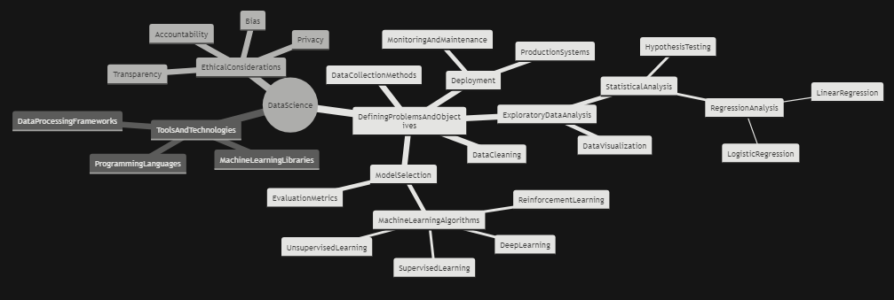
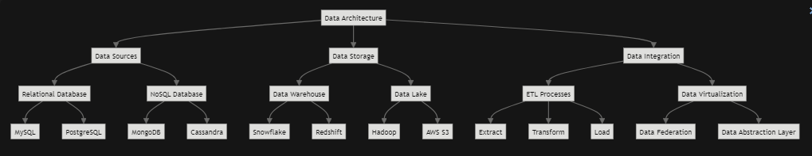
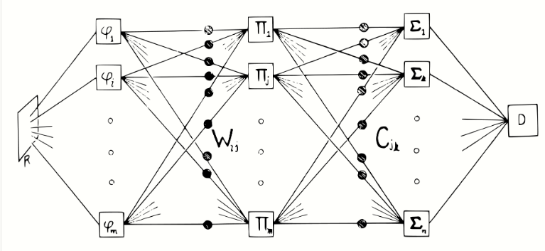
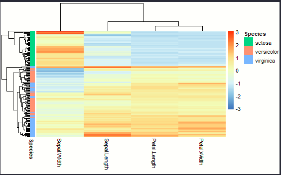
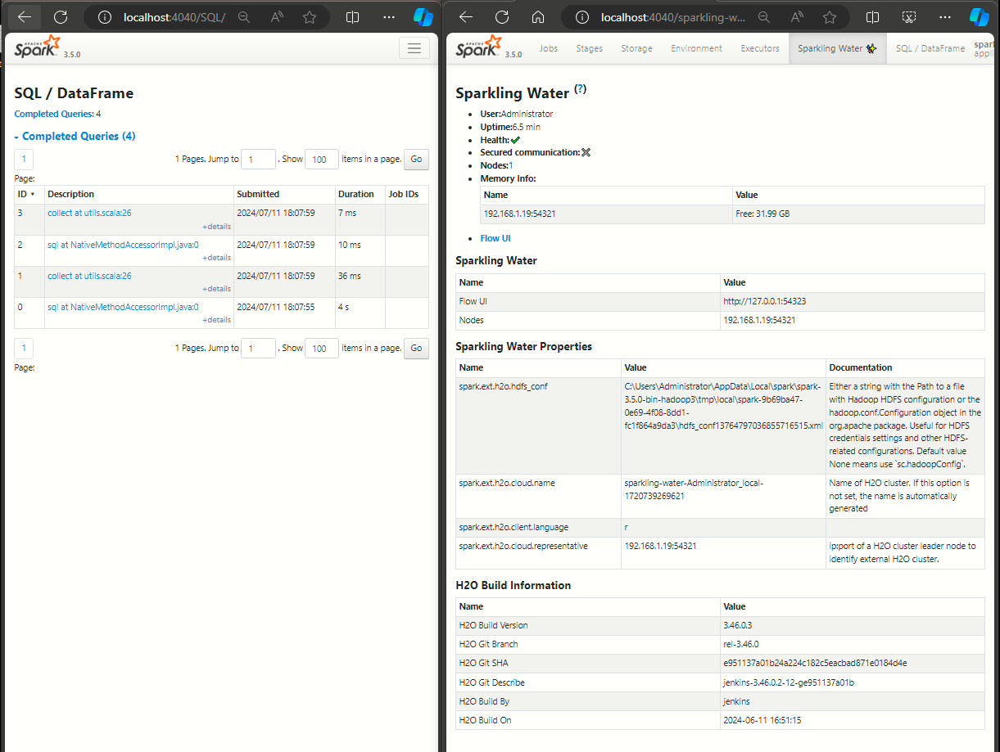
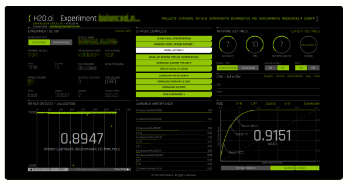

# **I. An Overview on Data Science, AI, & ML** {#sec-code-style style="line-height: 1.2;"}

This series is an overview on aspects Data Science, AI, & ML presented in HTML format with code embedded within. Any audience could grasp understanding from this presentation, and is intended to be helpful for a variety of different purposes. Having said the above please note this implementation features a modern multi-lingual approach using R Python, Julia, Rust, Java, Scala & SQL. In addition CPU, and parallel (CPU, GPU, & Quantum) computational architectures are implemented through wrappers to C, C++, & Cuda code. Their is a focus on opensource technologies, using Onyx, h2o_ai, & Spark for example, but also aspects of dealing with cloud computing (Azure, Amazon, Google). To understand the ins and outs of coding particulars inherently requires expertise in that particular domain. For those who are researching or looking to learn on their own, reproducible coding & data conventions have been implemented & the embedded code is well commented. Referencing is performed through html-links allowing for easy click & go sourcing. The series is available to all on Github, according to the platform licensing & conduct policies

<div>

### About Me {#sec-about-me}

A quick download about me for the curious. I am an Analytics Professional. Meaning I have worn the hats like Chief of Analytics/Sr. Principal Consultant or Sr. Data Architect / Sr. Solutions Architect for signature projects with budgets in dollars of 8, 9,or 10 figures, for entities like at&t, Center Point Energy, some marketing agencies under the Omnicom Umbrella, as well as federal Government with the VA, the Dept. of Health & Human Services, and even a special cabinet committee project for the white house (along with the required security clearances those entail) My educational background is:

-   **B.S. in Mathematics** from **University of Texas** in Probability, Statistics & Data Analysis & minors in Actuarial Science & Business Foundations.
-   **MBA** from **St. Edwards University** in Executive & Operations Management.
-   Graduated with **Honors** from the **Harvard Business Analytics Program**.

I got my start in consulting as an estimator for Drees Custom Homes, the largest private builder in the US, where I was matrix-ed out to the VP of Corporate Operations to modernize organizational workflows through innovation & technology in their 12 divisions nationwide. I helped at&t launch U-verse in one the first mega-budget projects to be managed end to end with analytics at that time. For Center Point Energy, there was a huge smart grid project , funded by the DOE, the State of Texas, the city of Houston & CNP. When it was all said & done my firm had built from the ground up, delivered, & transferred their operational analytics program for electricity distribution & Smart City Management. The technology was combo wireless mesh device network & WiMax system with significant OTA capabilities serving the fourth largest city in the country. No doubt, I was influenced by my father who was a Computer Scientist & my mother who was both an an engineer & Phd. in Neuroscience. Now let's get started.

</div>

{height="385"}

<div>

Data science is an interdisciplinary field that combines math, statistics, specialized programming, advanced analytics, artificial intelligence (AI), and machine learning. Its purpose is to uncover actionable insights hidden within data, usually with a data to decisions perspective.  [These insights guide decision-making and strategic planning1](https://www.ibm.com/topics/data-science)[2](https://en.wikipedia.org/wiki/Data_science). [In essence, data science examines large amounts of data to reveal hidden patterns, generate insights, and inform choices3](https://www.coursera.org/articles/what-is-data-science)

-   Data science is "a concept to unify [statistics](https://en.wikipedia.org/wiki/Statistics "Statistics"), [data analysis](https://en.wikipedia.org/wiki/Data_analysis "Data analysis"), [informatics](https://en.wikipedia.org/wiki/Informatics "Informatics"), and their related [methods](https://en.wikipedia.org/wiki/Scientific_method "Scientific method")" to "understand and analyze actual [phenomena](https://en.wikipedia.org/wiki/Phenomena "Phenomena")" with [data](https://en.wikipedia.org/wiki/Data "Data").^[[5]](https://en.wikipedia.org/wiki/Data_science#cite_note-5)^ It uses techniques and theories drawn from many fields within the context of [mathematics](https://en.wikipedia.org/wiki/Mathematics "Mathematics"), statistics, [computer science](https://en.wikipedia.org/wiki/Computer_science "Computer science"), [information science](https://en.wikipedia.org/wiki/Information_science "Information science"), and [domain knowledge](https://en.wikipedia.org/wiki/Domain_knowledge "Domain knowledge").^[[6]](https://en.wikipedia.org/wiki/Data_science#cite_note-:2-6)^ However, data science is different from [computer science](https://en.wikipedia.org/wiki/Computer_science "Computer science") and information science. [Turing Award](https://en.wikipedia.org/wiki/Turing_Award "Turing Award") winner [Jim Gray](https://en.wikipedia.org/wiki/Jim_Gray_(computer_scientist) "Jim Gray (computer scientist)") imagined data science as a "fourth paradigm" of science ([empirical](https://en.wikipedia.org/wiki/Empirical_research "Empirical research"), [theoretical](https://en.wikipedia.org/wiki/Basic_research "Basic research"), [computational](https://en.wikipedia.org/wiki/Computational_science "Computational science"), and now data-driven) and asserted that "everything about science is changing because of the impact of [information technology](https://en.wikipedia.org/wiki/Information_technology "Information technology")" and the [data deluge](https://en.wikipedia.org/wiki/Information_explosion "Information explosion").^[[7]](https://en.wikipedia.org/wiki/Data_science#cite_note-TansleyTolle2009-7)[[8]](https://en.wikipedia.org/wiki/Data_science#cite_note-BellHey2009-8)^

-   **Big Data** refers to extremely large and diverse collections of structured, unstructured, and semi-structured data that continues to grow exponentially over time. These data sets are so huge and complex in volume, velocity, and variety, that traditional data management systems cannot store, process, and analyze them. 

-   The amount and availability of data is growing rapidly, spurred on by digital technology advancements, such as connectivity, mobility, the **Internet of Things (IoT)**, and **Artificial Intelligence (AI)**. As data continues to expand and proliferate, new big data tools are emerging to help companies collect, process, and analyze data at the speed needed to gain the most value from it. 

-   A **Data Scientist** is a professional who creates programming code, applications, or platforms through implementing AI/ML/Modeling or Statistical knowledge to identify & deliver insights from data, or to ascertain capabilities which provide a competitive edge, improve profitability/efficiency, or to deliver on a product, project, program, or service quality or experience objectives. .^[[9]](https://en.wikipedia.org/wiki/Data_science#cite_note-9)^

-   A **Data Architect** is a practitioner of [data architecture](https://en.wikipedia.org/wiki/Data_architecture "Data architecture"), a data management discipline concerned with designing, creating, deploying and managing an organization's data architecture. Data architects define how the data will be acquired, transported, stored, consumed, integrated and managed by different data consuming entities and IT systems (The Customer), as well as any applications systems interacting with said data in some way.^[[1]](https://en.wikipedia.org/wiki/Data_architect#cite_note-1)^ It is closely allied with [business architecture](https://en.wikipedia.org/wiki/Business_architecture "Business architecture") and is considered to be one of the four domains of [enterprise architecture](https://en.wikipedia.org/wiki/Enterprise_architecture "Enterprise architecture").

-    A **CTO,** **CIO, CAO, CDO, CDsO, VP o**r **Director of Analytics / Decision Support** is a senior leader who oversees the comprehensive data/technology strategy and associated operations of an organization. Responsibilities include setting the vision, goals, and standards for data acquisition/management plan , as well as leading & managing teams of analysts, data scientists, architects and engineers. Organizations compile, acquire , research and use data to solve problems, optimize profit/efficiency, to minimize turnover/churn, or to streamline logistics, for the purpose of making better business decisions. They also assess the complex information operating environment including a host of forecasts, financials, market/product research, organizational & external human interactivity , with the goal of reaching simpler, faster, better, smarter decision data sets to improve performance or to develop new capabilities to attain or maintain a competitive advantage. Their technical expertise is paramount to stress test, the technological data processes for quality, punctuality, accuracy, & security, while exploiting & exploring in parallel.

</div>

{width="1216"}

> <div>
>
> ### **AI / ML - How did we get here?**
>
> The theoretical base for contemporary neural networks was independently proposed by [Alexander Bain](http://127.0.0.1:10679/#0 "Alexander Bain (philosopher)"){style="text-decoration: underline; color: rgb(225, 179, 245) !important;"} in 1873^[[6]](http://127.0.0.1:10679/#0){style="text-decoration: underline; color: rgb(225, 179, 245) !important;"}^ and [William James](http://127.0.0.1:10679/#0 "William James"){style="text-decoration: underline; color: rgb(225, 179, 245) !important;"} in 1890.^[[7]](http://127.0.0.1:10679/#0){style="text-decoration: underline; color: rgb(225, 179, 245) !important;"}^ Both posited that human thought emerged from interactions among large numbers of neurons inside the brain. In 1949, [Donald Hebb](http://127.0.0.1:10679/#0 "Donald Hebb"){style="text-decoration: underline; color: rgb(225, 179, 245) !important;"} described [Hebbian learning](http://127.0.0.1:10679/#0 "Hebbian learning"){style="text-decoration: underline; color: rgb(225, 179, 245) !important;"}, the idea that neural networks can change and learn over time by strengthening a synapse every time a signal travels along it.^[[8]](http://127.0.0.1:10679/#0){style="text-decoration: underline; color: rgb(225, 179, 245) !important; margin-bottom: 0.1em;"}^
>
> Artificial neural networks were originally used to model biological neural networks starting in the 1930s under the approach of [connectionism](http://127.0.0.1:10679/#0 "Connectionism"){style="text-decoration: underline; color: rgb(225, 179, 245) !important;"}. However, starting with the invention of the [perceptron](http://127.0.0.1:10679/#0 "Perceptron"){style="text-decoration: underline; color: rgb(225, 179, 245) !important;"}, a simple artificial neural network, by [Warren McCulloch](http://127.0.0.1:10679/#0 "Warren McCulloch"){style="text-decoration: underline; color: rgb(225, 179, 245) !important;"} and [Walter Pitts](http://127.0.0.1:10679/#0 "Walter Pitts"){style="text-decoration: underline; color: rgb(225, 179, 245) !important;"} in 1943,^[[9]](http://127.0.0.1:10679/#0){style="text-decoration: underline; color: rgb(225, 179, 245) !important;"}^ followed by the implementation of one in hardware by [Frank Rosenblatt](http://127.0.0.1:10679/#0 "Frank Rosenblatt"){style="text-decoration: underline; color: rgb(225, 179, 245) !important;"} in 1957,^[[3]](http://127.0.0.1:10679/#0){style="text-decoration: underline; color: rgb(225, 179, 245) !important; margin-bottom: 0.1em;"}^ artificial neural networks became increasingly used for machine learning applications instead, and increasingly different from their biological counterparts.
>
> **Modern Approaches**
>
> In 2012, technologists [Thomas H. Davenport](https://en.wikipedia.org/wiki/Thomas_H._Davenport "Thomas H. Davenport") and [DJ Patil](https://en.wikipedia.org/wiki/DJ_Patil "DJ Patil") declared "Data Scientist: The Sexiest Job of the 21st Century",^[[26]](https://en.wikipedia.org/wiki/Data_science#cite_note-26)^ a catchphrase that was picked up even by major-city newspapers like the [New York Times](https://en.wikipedia.org/wiki/New_York_Times "New York Times")^[[27]](https://en.wikipedia.org/wiki/Data_science#cite_note-27)^ and the [Boston Globe](https://en.wikipedia.org/wiki/Boston_Globe "Boston Globe").^[[28]](https://en.wikipedia.org/wiki/Data_science#cite_note-28)^ A decade later, they reaffirmed it, stating that "the job is more in demand than ever with employers".^[[29]](https://en.wikipedia.org/wiki/Data_science#cite_note-29)^
>
> **This is an R markdown document, it is a simple and easy to use plain text language that combines code, data, results from data operations (including plots and tables, pipelines, SP's, inputs & outputs) with commentary l combined into a single nicely formatted and reproducible document**.
>
> -   The series will be self contained in an RENV environment
>
> -   **I will use a specific data set for each part in the series, for For Part I will stick with the Iris data set so the reader**
>
> The ***Iris*** **flower data set** or **Fisher's *Iris* data set** is a [multivariate](https://en.wikipedia.org/wiki/Multivariate_statistics "Multivariate statistics") [data set](https://en.wikipedia.org/wiki/Data_set "Data set") used and made famous by the British [statistician](https://en.wikipedia.org/wiki/Statistician "Statistician") and [biologist](https://en.wikipedia.org/wiki/Biologist "Biologist") [Ronald Fisher](https://en.wikipedia.org/wiki/Ronald_Fisher "Ronald Fisher") in his 1936 paper *The use of multiple measurements in taxonomic problems* as an example of [linear discriminant analysis](https://en.wikipedia.org/wiki/Linear_discriminant_analysis "Linear discriminant analysis"). The data set consists of 50 samples from each of three species of *Iris* ([*Iris setosa*](https://en.wikipedia.org/wiki/Iris_setosa "Iris setosa"), [*Iris virginica*](https://en.wikipedia.org/wiki/Iris_virginica "Iris virginica") and [*Iris versicolor*](https://en.wikipedia.org/wiki/Iris_versicolor "Iris versicolor")). Four [features](https://en.wikipedia.org/wiki/Features_(pattern_recognition) "Features (pattern recognition)") were measured from each sample: the length and the width of the [sepals](https://en.wikipedia.org/wiki/Sepal "Sepal") and [petals](https://en.wikipedia.org/wiki/Petal "Petal"), in centimeters. Based on the combination of these four features, Fisher developed a linear discriminant model to distinguish the species from each other.
>
> </div>

{width="1100"}

##### Here is a peek preview at a teaser sample chunk of code, using the Iris data set. The outputs are 2 visuals, consider what makes them alike & what differentiates them.

```{r A_Neaural Network_Visual}

#  Intake ==> ETL ==> [Training Data_idx]

# The Well Known Iris Data Setis provided by R natively
data(iris)
iris$setosa <- iris$Species == "setosa"
iris$virginica <- iris$Species == "virginica"
iris$versicolor <- iris$Species == "versicolor"
iris.train.idx <- sample(x = nrow(iris), size = nrow(iris)*0.5)
iris.train <- iris[iris.train.idx,]
iris.valid <- iris[-iris.train.idx,]

# Pipe: data[]===> Neural_Net_Data-Model_Structure {NN_DM}

library(neuralnet)
iris.net <- neuralnet(setosa + versicolor + virginica ~
  Sepal.Length + Sepal.Width +  Petal.Length + Petal.Width, 
    data = iris.train,
     hidden = c(10,10), 
        err.fct = "ce", 
          linear.output = F, 
            lifesign = "minimal",
              stepmax = 1000000,
                threshold = 0.001,
                   rep = 5, )

# Provide a Visual [{NN_DM}]====>{Graph_/Out}

thematic::thematic_on(bg = 'black' , fg = 'white', accent = 'lightgreen' )
NN <- suppressWarnings( NeuralNetTools::plotnet(iris.net ,  
    circle_cex	= 4,
     circle_col = "black",
      bord_col = "lightgreen",
       neg_col = "pink",
        pos_col = "lightgreen",
         cex_val = .75, 
          max_sp = TRUE,
           BIAS = TRUE,
            bias_y = .5,
             pad_x = 1.28,
              alpha = .1,
               rel_rsc = .75,
                alpha_val = .5))


# Predict Code F{NN_DM}(Predict)

iris.prediction <- compute(iris.net, iris.valid[-5:-8])

# Index F{NN_DM}(Predict_idx)
idx <- apply(iris.prediction$net.result, 1, which.max)

predicted <- c('setosa', 'versicolor', 'virginica')[idx]

# Tab Data Structure
NN_DM_Predict__ <- table(predicted, iris.valid$Species)

NN_DM_Predict__ 
```

###### **(N=Nodes) 4_Input_N's \|\|—–—\> Bias_N1-------\>10_N's-Hidden-L1------\> Bias_N2-----\>10_N's Hidden_L2------\> Bias_N'3 –—— \>\>3_Output_N's** {#sec-4-NN_Intro style="color: lightgreen;"}

###### 3 errors: classifying 1 versicolor as a virginica & classifying a 2 virginica's as a versicolor's, will revisit at the very end {style="color: yellow;"}

```{r Iris_Visual}

library(GGally);library(viridis);library(hrbrthemes)

# A Visual from the Iris Data Set
suppressWarnings( ggparcoord(
  iris,
   columns = 1:4, 
    groupColumn = 5, 
     order = "anyClass",
      scale = "globalminmax",
        showPoints = TRUE, 
          title = "No scaling",
            alphaLines = 0.3) + 
  
scale_color_viridis(discrete = TRUE) )

  
```

##### ***Visual: A classifier leverages patterns in data, ponder how the previous 2 visuals might relate to each other.*** {style="color: yellow;"}

#### **R Set Up**

```{r setup}

# options
options(warn = -1)
auto.snapshot <- getOption("renv.config.auto.snapshot")
knitr::opts_chunk$set(message = FALSE)
knitr::opts_chunk$set(warning = FALSE)
knitr::opts_chunk$set(renvfig.showtext = TRUE)

# Initial packages loaded 
librarian::shelf(
#DATA/PARSING/PIPING
library(viridis), library(magrittr), library(dplyr,quietly = T), library(showtext),
# HTML/RMARKDOWN 
library(rmdformats), library(bookdown), library(bslib), library(knitr), library(RColorBrewer),
library(hrbrthemes),
#PARRALELL/GPU/SYSTEM
library(parallelly), library(torch), library(benchmarkme), library(here),
#SPARK/h2o/Sarkling_Water
library(sparklyr), library(sparklyr.nested), library(sparktf), library(torch), library(arrow),
library(sparklyr), library(rsparkling),library(h2o), library(h2otools),
#VISUALS
library(plotly), library(ggplo2), library(ggforce), library(ggpubr), library(GGally),
#TEXT
library(text),
#PYTHON
library(reticulate),
#MODELING 
library(neuralnet), library(usemodels), library(C50), library(dials), library(embed), 
library(xgboost), library(Matrix),
library(tidymodels,quietly = T), library(caret,quietly = T))

PicPath = 'c:/Users/Administrator/Documents/R/NLP/udpipemodels/images_'

thematic::thematic_rmd()
thematic::thematic_on(bg = 'black' , fg = 'white', accent = 'lightgreen' )

# Implementing Timing Features 

knitr::opts_chunk$set(time_it = TRUE)
knitr::knit_hooks$set(time_it = local({
  now <- NULL
  function(before, options) {
    if (before) {
      # record the current time before each chunk
      now <<- Sys.time()
    } 
    else {
      # calculate the time difference after a chunk
      res <- difftime(Sys.time(), now, units = "secs")
      # return a character string to show the time
      paste("Time for this code chunk to run:", base::round(res,2), "seconds")
    }
  }
 }))

```

##### Here are my system specs, OS is Server 2022 on a Lenovo \IBM SR 635 Hyperscale DC EPYC CHIP

```{r system-specs}

# Project
here::dr_here()

# System Architecture 
benchmarkme::get_ram()
benchmarkme::get_cpu()

# FROM TORCH
library(torch)

cuda_device_count()
 cuda_current_device()
   cuda_is_available()
     cuda_runtime_version()

cuda_get_device_capability(device = cuda_current_device())

```

Let's talk ML, AI, Neural Networks, & Deep Learning

-   A neural network is a group of interconnected units called [neurons](http://127.0.0.1:10679/#0 "Neurons"){style="text-decoration: underline; color: rgb(225, 179, 245) !important;"} that send signals to one another. Neurons can be either [biological cells](http://127.0.0.1:10679/#0 "Cell (biology)"){style="text-decoration: underline; color: rgb(225, 179, 245) !important;"} or [mathematical models](http://127.0.0.1:10679/#0 "Mathematical model"){style="text-decoration: underline; color: rgb(225, 179, 245) !important;"}. While individual neurons are simple, many of them together in a network can perform complex tasks. There are two main types of neural network.

    -   In [neuroscience](http://127.0.0.1:10679/#0 "Neuroscience"){style="text-decoration: underline; color: rgb(225, 179, 245) !important;"}, a [biological neural network](http://127.0.0.1:10679/#0 "Biological neural network"){style="text-decoration: underline; color: rgb(225, 179, 245) !important;"} is a physical structure found in [brains](http://127.0.0.1:10679/#0 "Brain"){style="text-decoration: underline; color: rgb(225, 179, 245) !important;"} and complex [nervous systems](http://127.0.0.1:10679/#0 "Nervous system"){style="text-decoration: underline; color: rgb(225, 179, 245) !important;"} – a population of nerve cells connected by [synapses](http://127.0.0.1:10679/#0 "Synapse"){style="text-decoration: underline; color: rgb(225, 179, 245) !important;"}.

    -   In [machine learning](http://127.0.0.1:10679/#0 "Machine learning"){style="text-decoration: underline; color: rgb(225, 179, 245) !important;"}, an [artificial neural network](http://127.0.0.1:10679/#0 "Artificial neural network"){style="text-decoration: underline; color: rgb(225, 179, 245) !important;"} is a mathematical model used to approximate [nonlinear functions](http://127.0.0.1:10679/#0 "Nonlinear function"){style="text-decoration: underline; color: rgb(225, 179, 245) !important;"}. Artificial neural networks are used to solve [artificial intelligence](http://127.0.0.1:10679/#0 "Artificial intelligence"){style="text-decoration: underline; color: rgb(225, 179, 245) !important;"} problems.

    -   In machine learning, a neural network is an artificial mathematical model used to approximate nonlinear functions. While early artificial neural networks were physical machines,[[3]](http://127.0.0.1:10679/#0){style="text-decoration: underline; color: rgb(225, 179, 245) !important;"} today they are almost always implemented in [software](http://127.0.0.1:10679/#0 "Neural network software"){style="text-decoration: underline; color: rgb(225, 179, 245) !important; margin-bottom: 0.1em;"}.

    -   [Neurons](http://127.0.0.1:10679/#0 "Artificial neuron"){style="text-decoration: underline; color: rgb(225, 179, 245) !important;"} in an artificial neural network are usually arranged into layers, with information passing from the first layer (the input layer) through one or more intermediate layers (hidden layers) to the final layer (the output layer).[[4]](http://127.0.0.1:10679/#0){style="text-decoration: underline; color: rgb(225, 179, 245) !important;"} The "signal" input to each neuron is a number, specifically a [linear combination](http://127.0.0.1:10679/#0 "Linear combination"){style="text-decoration: underline; color: rgb(225, 179, 245) !important;"} of the outputs of the connected neurons in the previous layer. The signal each neuron outputs is calculated from this number, according to its [activation function](http://127.0.0.1:10679/#0 "Activation function"){style="text-decoration: underline; color: rgb(225, 179, 245) !important;"}. The behavior of the network depends on the strengths (or weights) of the connections between neurons. A network is trained by modifying these weights through [empirical risk minimization](http://127.0.0.1:10679/#0 "Empirical risk minimization"){style="text-decoration: underline; color: rgb(225, 179, 245) !important;"} or back propagation in order to fit some preexisting data set.[[5]](http://127.0.0.1:10679/#0){style="text-decoration: underline; color: rgb(225, 179, 245) !important; margin-bottom: 0.1em;"}

    -   Neural networks are used to solve problems in [artificial intelligence](http://127.0.0.1:10679/#0 "Artificial intelligence"){style="text-decoration: underline; color: rgb(225, 179, 245) !important;"}, and have thereby found applications in many disciplines, including [predictive modeling](http://127.0.0.1:10679/#0 "Predictive modeling"){style="text-decoration: underline; color: rgb(225, 179, 245) !important;"}, [adaptive control](http://127.0.0.1:10679/#0 "Adaptive control"){style="text-decoration: underline; color: rgb(225, 179, 245) !important;"}, [facial recognition](http://127.0.0.1:10679/#0 "Facial recognition system"){style="text-decoration: underline; color: rgb(225, 179, 245) !important;"}, [handwriting recognition](http://127.0.0.1:10679/#0 "Handwriting recognition"){style="text-decoration: underline; color: rgb(225, 179, 245) !important;"}, [general game playing](http://127.0.0.1:10679/#0 "General game playing"){style="text-decoration: underline; color: rgb(225, 179, 245) !important;"}, and [generative AI](http://127.0.0.1:10679/#0 "Generative AI"){style="text-decoration: underline; color: rgb(225, 179, 245) !important; margin-bottom: 0.1em;"}.

{width="850"}

The simplest machine learning algorithm is the Perceptron Algorithm, used to determine whether an input belongs to one class or another.

Example-#1, the Perceptron algorithm can determine the AND operator—given binary inputs x1 and x2, is (x1 AND x2) equal to 0? or 1?

In this example we have the classic binary operation, the logical AND [&].The Perceptron is the purple dashed line. Which has effectively parsed the 2 dimensional permutation space 0 ==\> 1 with a decision boundary. Passing the purple line means you are one & not zero. This example, visually makes clear that, this is a linear class operator for sub-setting or classifying objects, events, or data structures. \| \*0 1 In 1957, Frank Rosenblatt "invented" a Perceptron program, on an IBM 704 computer at Cornell Aeronautical.

During that time, scientists had discovered that brain cells (Neurons) receive input from our senses by electrical signals.The Neurons, then again, use electrical signals to store information, and to make decisions based on previous input. The Neurons, then again, use electrical signals to store information, and to make decisions based on previous input. He correlated electrical stimulation with brain activity & learning. Frank, a rained psychologist, had the idea that his Perceptrons could simulate brain principles, with the ability to learn and make decisions.

{style="fig.align" width="850"}

In the context of machine learning, a neural network is an artificial mathematical model used to approximate nonlinear functions. While early artificial neural n which can be networks were physical machines,[3] today they are almost always implemented in software. Perceptrons & Neural Networks are forms of Supervised learning can be separated into two types of problems when data mining: classification and regression:

Classification problems use an algorithm to accurately assign test data into specific categories, such as separating apples from oranges. Or, in the real world, supervised learning algorithms can be used to classify spam in a separate folder from your inbox. Linear classifiers, support vector machines, decision trees and random forest are all common types of classification algorithms. Regression is another type of supervised learning method that uses an algorithm to understand the relationship between dependent and independent variables. Regression models are helpful for predicting numerical values based on different data points, such as sales revenue projections for a given business. Some popular regression algorithms are linear regression, logistic regression, and polynomial regression.

## **II . A Neural Net in Action** {style="line-height: 1.2;"}

```{r Iris-NN_in_Action}

library(neuralnet); library(caret)

# Iris has 3 species & 4 attributes to model 
data("iris"); str(iris); set.seed(19)


#Intake ==> ETL ==> [Training Data_idx]
 
indexes = createDataPartition(iris$Species, p = .85, list = F)

train = iris[indexes, ] ; test = iris[-indexes, ] 

xtest = test[, -5] ; ytest = test[, 5]


# Pipe: data[]===> Neural_Net_Data-Model_Structure {NNet_DM}

nnet =  neuralnet(
                  Species~., 
                  train,
                  hidden = c(4,3),
                  linear.output = FALSE
                 )


# Provide a Visual [{NNet_DM}]====>{Graph_/Out}

plot(
     nnet,
     col.entry.synapse = "grey1", 
     col.entry = "brown",
     col.hidden = "lightgreen", 
     col.hidden.synapse = "grey",
     col.out = "red", 
     col.out.synapse = "black",
     col.intercept = "black",
     information = TRUE,
     fontsize = 9,
     arrow.length = .15,
     rep = "best"
     )

```

```{r NN_Plot}

thematic::thematic_on(
                      bg = 'black' , 
                      fg = 'white', 
                      accent = 'lightgreen'
                     )

NN <- suppressWarnings( 
                        NeuralNetTools::plotnet(nnet, 
                                      circle_cex	= 4,
                                      circle_col = "black",
                                      bord_col = "lightgreen",
                                      neg_col = "pink",
                                      pos_col = "lightgreen",
                                      cex_val = .55, 
                                      alpha_val = .5)
                      )

```

The learning rate in machine learning is generally referred to by the hyper-parameter that determines the step size at each iteration while moving toward a minimum of a loss function. It controls how much the model’s weights are updated during training. An analytical method cannot be used to calculate the weights of a neural network. Instead, the weights must be discovered using stochastic gradient descent, an empirical optimization approach. In simpler terms, the stochastic gradient descent algorithm is used to train deep learning rate neural networks. A typical value for the learning rate is between 0.0 and 1.0. In actuality though, we have 2 kinds of learning or updating of our models.

-   Machine learnable parameters – The parameters that the algorithms learn/estimate on their own during training for a particular data set.

-   Hyper-parameters are variables that machine learning engineers or data scientists provide precise values to regulate how algorithms learn and modify the model’s performance.

An analytical method cannot be used to calculate the weights of a neural network. Instead, the weights must be discovered using stochastic gradient descent, an empirical optimization approach. In simpler terms, the stochastic gradient descent algorithm is used to train deep learning rate neural networks So what does Learning Rate look like?

```{r activation_functions}

library(ggplot2)
library(ggpubr)
library(plotly)

# Neural networks are neurons that are sequentially connected. Each of this sequence is called neuron layer.

set.seed(19)

circular <- function(x, R, centerX=0, centerY=0){
r = R * sqrt(runif(x))
theta = runif(x) * 2 * pi
x = centerX + r * cos(theta)
y = centerY + r * sin(theta)

z = data.frame(x = x, y = y)
return(z)
}

data1 <- circular(150,0.5)
data2 <- circular(150,1.5)

data1$Y <- 1
data2$Y <- 0
data_c <- rbind(data1,data2)


color <- c("yellow", "lightgreen")
plot(data_c, col = factor(data_c$Y))

rm(data1,data2, circular)

# Here is what we have so far:
library(ggplot2)
Plot1 <- ggplot(data_c ,aes(x,y, col = as.factor(Y))) + geom_point()

#Classification problem to solve with a neural network built from scratch in R
X <- as.matrix(data_c[,1:2])
Y <- as.matrix(data_c[,3])


# Its now time to create the structure of the neural network. To do so, we will implement a Class-Neuron which we can iterate through.
# This class will have the following parameters: Number of neurons on the layers 1,  Number of neurons on layer 2, the number of connections

neuron <- setRefClass(
                      "neuron",
                      fields = list(
                      fun_act = "list",
                      number_connections = "numeric",
                      number_neurons = "numeric",
                      W = "matrix",
                      b = "numeric"
                     ),
                     
 # Here is our activation function
methods = list(
initialize = function(
                      fun_act, 
                      number_connections,
                      number_neurons)
    {
      fun_act <<- fun_act
      number_connections <<- number_connections
      number_neurons <<- number_neurons
      
      W <<- matrix(runif(number_connections*number_neurons),nrow = number_connections)
     
       b <<- runif(number_neurons)
    }
  )
)


# Retrieve the activation functions & their derivatives ==> very useful when implementing gradient descent. 

# Sigmoid activation function and it’s derivative as follows:
sigmoid = function(x) 
  {
  y = list() 
  y[[1]] <- 1 / (1 + exp(-x))
  y[[2]] <- x * (1 - x)
  return(y)
  }

x <- seq(-5, 5, 0.01)
#s <- plot(x, sigmoid(x)[[1]], col = 'lightgreen')

# Relu activation function and it’s derivative as follows:
relu <- function(x)
  {
  y <- list()
  y[[1]] <- ifelse(x < 0,0,x)
  y[[2]] <- ifelse(x < 0,0,1)
  return(y)
  }

#r = plot(x, relu(x)[[1]], col = 'lightgreen')


# The weights for the incoming connections (W):, Bias(b): is added to every neuron after being weighted with W. 

n = ncol(X)                                     #Number of neurons Primary level 
capas = c(n, 4, 8, 1)                           # Number of neurons hidden level 
Function = list(sigmoid, relu, sigmoid)                   # Activation Functions
fuscia <- list()


for (i in 1:(length(capas) - 1))
  {
    fuscia[[i]] <- neuron$new(Function[i],capas[i], capas[i + 1])
  }


library(crayon)

cli::cli_alert_info("Class Definition: {fuscia}")
cat(green("\n  Class Instance created"));fuscia

fuscia

cat(yellow("\n This is a field in class neuron\n",neuron$fields(), "\n"))

# create a new plotting window and set the plotting area into a 1*2 array
par(mfrow = c(1, 2))
suppressWarnings(plot(x, relu(x)[[1]], col = 'lightgreen', title = 'relu'))
suppressWarnings(plot(x, sigmoid(x)[[1]], col = 'lightgreen', title = 'rsigmoid'))

suppressWarnings(ggplotly(Plot1))

cli::cli_alert_success(cat(yellow("\n Thus, we have a S4 class fuscia neuron, next we initialize the parameters W and b with the function runif   ")))


```

##### ***Output: Be sure to see the class definition with data & its fields.*** {style="color: yellow;"}

{width="880"}

{width="850"}

## Activation / Loss Functions

Loss Function: A function that returns the cost associated with the model and measures how well our model is doing on the training data. If the cost is too high, it means that the predictions by our model are deviating too much from the observed data. In any machine learning algorithm, our ultimate mission is to minimize the loss function, sometimes referred to as the evolution of the error.

```{r Learning_Rates}

# Training the Neural Network: Forward Propagation
# When doing the forward pass we will store the results of the neuron before and after applying the activation functions (z).
#  This will be useful on back propagation.

set.seed(19)
conflicted::conflicts_prefer(base::`%*%`)

entry <- function(fuscia, X,Y, cost){
out = list()
out[[1]] <- append(list(matrix(0,ncol = 2,nrow = 1)), list(X))
 i = 0
  for (i in c(1:(length(fuscia)))) {
    z = list((out[[length(out)]][[2]] %*% fuscia[[i]]$W + fuscia[[i]]$b))
    a = list(fuscia[[i]]$fun_act[[1]](z[[1]])[[1]])
    out[[i + 1]] <- append(z,a)
  }
return(out)
}

cost <- function(Yp,Yr){
y <- list()
y[[1]] <- mean((Yp - Yr)^2)
y[[2]] <- (Yp - Yr)
return(y)

forward <- entry(fuscia, X,Y, cost)
head(forward[[4]][[2]]) 
}

#- Implemented a neural network ==> Examine Performance
#- Implementing front and back propagation w/ gradient descent on the same function

fuscia_neuronal <- function(red, X,Y, cost,lr = 0.05){
## Front Prop
out = list()
out[[1]] <- append(list(matrix(0,ncol = 4,nrow = 1)), list(X))
 i = 0
  for (i in c(1:(length( fuscia)))) 
    {
    z = list((out[[length(out)]][[2]] %*% fuscia[[i]]$W + fuscia[[i]]$b))
    a = list( fuscia[[i]]$fun_act[[1]](z[[1]])[[1]])
    out[[i + 1]] <- append(z,a)
    }

## Back-prop & Gradient Descent
delta <- list() 

for (i in rev(1:length( fuscia))) 
  {
  z = out[[i + 1]][[1]]
  a = out[[i + 1]][[2]]
  if (i == length( fuscia)) 
    {
    delta[[1]] <- cost(a,Y)[[2]] * fuscia[[i]]$fun_act[[1]](a)[[2]]
    } 
  else{
    delta <- list(delta[[1]] %*% W_temp * fuscia[[i]]$fun_act[[1]](a)[[2]],delta)
      }
  W_temp = t(fuscia[[i]]$W)
  fuscia[[i]]$b <-  fuscia[[i]]$b - mean(delta[[1]]) * lr
  fuscia[[i]]$W <-  fuscia[[i]]$W - t(out[[i]][[2]]) %*% delta[[1]] * lr
 }
return(out[[length(out)]][[2]])
}
  
 # Test neural network n = 2500
result <- fuscia_neuronal(fuscia, X,Y, cost)
dim(result)

i_ = 0

for (i_ in seq(2500)) {
  Yt = fuscia_neuronal(fuscia, X,Y, cost, lr = 0.01)
  if (i_ %% 25 == 0) 
    {
    if (i_ == 25) 
      {
      iteration <- i_
      error <- cost(Yt,Y)[[1]]
      }
    else
      {
       iteration <- c(iteration,i_)
       error <- c(error,cost(Yt,Y)[[1]])      
      }
    }
}


# visualize how the error of our neural network has evolved:

thematic::thematic_on(bg = 'black' , fg = 'lightgreen', accent = 'pink' )
plot(error)
  
library(plotly)

thematic::thematic_on(bg = 'black' , fg = 'white', accent = 'lightgreen' )

Loss_model <-  plot_ly(x = iteration, 
                       y =  error, 
                       type = 'scatter', 
                       mode = 'lines',
                       line = list(color = 'lightgreen'))

  Loss_model |> 
    plotly::layout(paper_bgcolor = "black",
      title = "Error for the  Fuscia Nueronal",
       font = list(color = 'white'),
        plot_bgcolor = "grey2",
         xaxis = list(title = "Iterations",
                      gridcolor = 'grey',
                      showgrid = TRUE,
                      showline = TRUE,
                      showticklabels = TRUE,
                      tickcolor = 'white',
                      ticks = 'outside',
                      zeroline = FALSE),
         yaxis = list(title = "Loss",
                      gridcolor = 'grey',
                      showgrid = TRUE,
                      showline = TRUE,
                      showticklabels = TRUE,
                      tickcolor = 'white',
                      ticks = 'outside',
                      zeroline = FALSE))
  
  

```

## **III. The Effect of Gradient Descent**

**Learning Rate:** This is the hyperparameter that determines the steps the gradient descent algorithm takes. Gradient Descent is too sensitive to the learning rate. If it is too big, the algorithm may bypass the local minimum and overshoot. If it too small, it might increase the total computation time to a very large extent. We will see the effect of the learning rate in depth later in the article.

**Gradient:** Basically, it is a measure of the steepness of a slope. And technically, when we sum up all the first-order derivatives of all the variables in a function, it gives us gradient. For example, if we consider linear regression, we have two parameters, slope, and the intercept, to minimize. So, we calculate derivatives w.r.t. both slope & the intercept and then sum them up to get the gradient for it.

**Descent:** To optimize parameters, we need to minimize errors. The aim of the gradient descent algorithm is to reach the local minimum (though we always aim to reach the global minimum of the function. But if a gradient descent algorithm once attains the local minimum, it is nearly impossible to reach the global minimum.). The algorithm accomplishes this by an iterative process of calculating step size at every iteration. And, this iterative calculation of step size to reach a local minimum (or in other words, descending to the point of minimum) is known as the descent (Enough of that going down the hill example).

```{r Gradient_Descent}

# Use Oranges Data Set
library(RColorBrewer)
data("Orange")

# Determine number of iterations
niter <- 85

# Determine learning rate / step size
alpha <- 1e-4

set.seed(19)
b0 <- rnorm(1) # intercept
b1 <- rnorm(1) # slope

# Set palette
cols <- colorRampPalette(rev(brewer.pal(n = 7, name = "RdBu")))(niter)
cols2 <- colorRampPalette((brewer.pal(n = 7, name = "RdBu")))(niter)

# Plot
 plotly::layout(matrix(c(1,1,2,2,3), nrow = 1, ncol = 5))
plot(age ~ circumference, data = Orange, 
     pch = 16,
     xlab = "Circumference (mm)",
     ylab = "Age (days)",
     col = cols2,
     col.axis = 'gold')


# Perform gradient descent
slopes <- rep(NA, niter)
intercepts <- rep(NA, niter)

for (i in 1:niter) {  
# prediction
  y <- b0 + b1 * Orange$circumference
  
# b0 = b0 - dJ/da * alpha
  b0 <- b0 - sum(y - Orange$age) / nrow(Orange) * alpha
  
# b1 = b1 - dJ/db * alpha
  b1 <- b1 - sum((y - Orange$age) * Orange$circumference) / nrow(Orange) * alpha
  abline(a = b0, b = b1, col = cols[i], lty = 2)
  
# Save estimates over all iterations
  intercepts[i] <- b0
  slopes[i] <- b1
}

title("Regression Fit")


# Cost function contour
allCombs <- expand.grid(
                        b0 = seq(-50, 50, 
                        length.out = 100),
                        b1 = seq(7.5, 8.5, 
                        length.out = 100)
                        )

res <- matrix(NA, 100, 100)
# a by rows, b by cols
for (i in 1:nrow(allCombs))
   {
    y <- allCombs$b0[i] + allCombs$b1[i] * Orange$circumference
    res[i] <- sum((y - Orange$age)**2)/(2*nrow(Orange))
   }

par( bg = "black", fg = "white")


# Plot MSE contour Diagram
contour(
        t(res), 
        xlab = expression(beta[1]),
        ylab = expression(beta[0]), 
        axes = F,
        nlevels = 25,
        col = cols2,
        col.lab = 'beige'
       )
  
axis(1, at = c(0, .5, 1), labels = c(7.5, 8, 8.5), col = 'lightyellow' , col.axis = 'yellow')
axis(2, at = c(0, .5, 1), labels = c(-50, 0, 50) , col = 'lightyellow' , col.axis = 'yellow')

points(
       (slopes - min(allCombs$b1)) / diff(range(allCombs$b1)),
       (intercepts - min(allCombs$b0)) / diff(range(allCombs$b0)),
        pch = 19, 
        cex = 1.5,
        col = cols,
        col.lab = 'beige'
  
)

title("MSE contour")

# Add colorbar
z = matrix(1:niter, nrow = 1)
image(
      1, 
      1:niter, z,
      col = cols, 
      axes = FALSE,
      xlab = "", 
      ylab = ""
      )

title("Iteration No.", col = 'white')
axis(2, at = c(1, seq(5, niter, by = 5)))


```

##### Visual: As the number of iterations increase from[ BLUE]: 1 \|-—-\|\> 85 :["Red"] The Model_fit & MSE tightens {style="color: lightblue;"}

## **IV. Exploratory Data Analysis (EDA) & ERM**

::: {style="color: lightgreen;"}
| We have to be able to communicate what is happening in these NN's to our customers. Using Exploratory Data Analysis (EDA) visuals (below), we can present what is going on under the hood related to how to a NN distinguishes the Iris Setosa from the other two species based on petal length alone. See the below regresion line & residuals plot.
:::

```{r Oranges_Linear}

library(plotly)
library(ggplot2)

# LM Plot 
p <- ggplot(Orange, aes(circumference, age))

# Use jitter to reduce overplotting
p <- p + geom_jitter(position = position_jitter(width = 0.5, height = 0.5)) + 
  geom_density_2d(aes(color = ..level..)) + 
  scale_color_viridis_c() + 
  geom_smooth(method = 'lm', formula =  y~x)


# Residuald Plot
library(broom)

mod <- lm(Orange$age ~ Orange$circumference )
df <- augment(mod)
g <- ggplot(df, aes(x = .fitted, y = .resid)) 

# Use jitter to reduce overplotting
g <- g + geom_jitter(position = position_jitter(width = 0.5, height = 0.5)) + 
     geom_density_2d(aes(color = ..level..)) + 
     scale_color_viridis_c() + 
     geom_smooth(method = 'lm', formula =  y~x)

par(c(1,2))
ggplotly(p)
ggplotly(g)


```

Principal Component Analysis Interactive Plot

The EDA could include the Principal component analysis (PCA), which is a projection of the 4-dimensional iris flowering data on 2-dimensional space using the first two principal components. We can see that the first principal component alone is useful in distinguishing the three species.

-   We could use simple rules like this: If PC1 \< -1, then Iris Setosa.
-   If PC1 \> 1.5 then Iris Virginica.
-   If -1 \< PC1 \< 1, then Iris Versicolor.

It is these patterns & others which we are leveraging in NN's.

```{r pca_2}

library(plotly)

data(iris)

axis = list(showline = FALSE,
            zeroline = FALSE,
            gridcolor = '#ffff',
            ticklen = 4,
            titlefont = list(size = 13))


fig  <- iris %>%
  plot_ly()

fig <- fig %>%
  add_trace(
            type = 'splom',
            dimensions = list(
           list(label = 'sepal length', values = ~Sepal.Length),
           list(label = 'sepal width', values = ~Sepal.Width),
           list(label = 'petal length', values = ~Petal.Length),
           list(label = 'petal width', values = ~Petal.Width)
           ),
 
           color = ~ Species, 
           colors = c('#636EFA','#EF553B','#00CC96') ,
           marker = list(size = 7,
                         line = list(
                                     width = 1,
                                     color = 'rgb(230,230,230)'
                                    )
                        )
          )    

fig <-  fig %>% plotly::style(diagonal = list(visible = FALSE))

fig <- fig %>%
plotly::layout(
                hovermode = 'closest',
                dragmode = 'select',
                plot_bgcolor = "lightgrey",
                xaxis = list(
                             domain = NULL, 
                             showline = F, 
                             zeroline = F,
                             gridcolor = '#ffff', 
                             ticklen = 4
                            ),
                yaxis = list(
                             domain = NULL, 
                             showline = F,
                             zeroline = F, 
                             gridcolor = '#ffff', 
                             ticklen = 4
                            ),
                xaxis2 = axis,
                xaxis3 = axis,
                xaxis4 = axis,
                yaxis2 = axis,
                yaxis3 = axis,
                yaxis4 = axis 
             )

# Create scatterplots all pairwise combinations for the 4 variables 

fig

pca <- prcomp(iris[, 1:4], scale = TRUE) 
pca 

# Have a look at the results.  
# extract first two columns and convert to data frame 

pcaData <- as.data.frame(pca$x[, 1:2]) 
pcaData <- cbind(pcaData, iris$Species) 
colnames(pcaData) <- c("PC1", "PC2", "Species")   

# compute % variances 

percentVar <- base::round(100 * summary(pca)$importance[2, 1:2], 0)  


# starting ggplot2  add data points, x label, y label  

library(ggplot2)

q <-  ggplot(pcaData, 
             aes(PC1, 
                 PC2, 
                 color = Species, 
                 shape = Species)) +  
                 geom_point(size = 2) + 
                 xlab(paste0("PC1: ", percentVar[1], "% variance")) +
                 ylab(paste0("PC2: ", percentVar[2], "% variance")) +                  ggtitle("Principal component analysis (PCA)") 

ggplotly(q)

```

We can gain many insights from EDA. Interactive analytics allows for a better experience for the customer & as well as the provider. It promotes engagement, & creates data opportunities that a static experience may miss on. For example take the visual below.

-   The 150 flowers in the rows are organized into different clusters.

-   Setosa samples obviously formed a unique cluster, characterized by smaller (blue) petal length, petal width, and sepal length.

-   The other two subspecies are not clearly separated but we can notice that some I.

-   Virginica samples form a small sub cluster showing bigger petals.

-   The columns are also organized into dendrograms, which clearly suggest that petal length and petal width are highly correlated. Thus we can communicate partly how these attributes are considered through our NN model weights, & what factors contribute to their magnitudes (strength) & charge,( i.e positive / negative ).

-   Heat Map - The following code will build the tree divided heat map with the Iris data set.

    ::: {style="color: lightgreen;"}
    | library(pheatmap) ma \<- as.matrix(iris[, 1:4])
    | 
    | \# assign row names in the matrix convert to matrix
    | row.names(ma) \<- row.names(iris)
    |  par( bg = "black", fg = "white")
    | 
    | pheatmap\_ \<- pheatmap(ma, scale = "column",
    | clustering_method = "average",
    | annotation_row = iris[, 5, drop = FALSE],
    | show_rownames = FALSE,
    | width = 7,
    | height = 5,)
    :::

\_\_\_\_\_{width="1100"}\_\_\_\_\_\_\_\_\_\_\_\_\_\_\_\_\_\_\_\_\_\_\_\_\_\_\_\_\_\_\_\_\_\_\_\_\_\_\_\_\_\_\_\_\_\_\_\_\_\_\_\_\_\_\_\_\_\_\_\_\_\_\_\_\_\_\_\_\_\_\_\_\_\_\_\_\_\_\_\_\_\_\_\_\_\_\_\_\_\_\_\_\_\_\_\_

### **Empirical Risk Minimization ERM**

In general, the risk 𝑅(ℎ) cannot be computed because the distribution 𝑃(𝑥,𝑦) is unknown to the learning algorithm (this situation is referred to as [agnostic learning](https://en.wikipedia.org/w/index.php?title=Agnostic_learning&action=edit&redlink=1 "Agnostic learning (page does not exist)")). However, given a sample of independent and identically distributed ([iid](#0 "Independent and identically distributed random variables"){style="font-size: 12pt;"} training data points, we can compute an [estimate](#0 "Estimate (statistics)"){style="font-size: 12pt;"}, called the empirical risk, by computing the average of the loss function over the training set; more formally, computing the expectation with respect to the [empirical measure](#0 "Empirical measure"){style="font-size: 12pt;"}:

𝑅emp(ℎ) = 1𝑛∑𝑖 =1𝑛 𝐿( ℎ(𝑥𝑖), 𝑦𝑖) {alt="{\\displaystyle \\!R_{\\text{emp}}(h)" style="color:  white;"}

The empirical risk minimization principle[[1]](https://en.wikipedia.org/wiki/Empirical_risk_minimization#cite_note-1) states that the learning algorithm should choose a hypothesis ℎ\^ which minimizes the empirical risk over the hypothesis class 𝐻:

ℎ\^ = arg min ℎ∈𝐻 𝑅 emp(ℎ) {alt="{\\displaystyle {\\hat {h}}" style="color: lightgreen;"}

Thus, the learning algorithm defined by the empirical risk minimization principle consists in solving the above [optimization](https://en.wikipedia.org/wiki/Mathematical_optimization "Mathematical optimization") problem.

activation functions. Advanced features such as adaptive learning rate, rate annealing, momentum training, dropout, L1 or L2 regularization, checkpoints, and grid search enable high predictive accuracy. Each compute node trains a copy of the global model parameters on its local data with multi-threading (asynchronously) and contributes periodically to the global model via model averaging across the network.

## **V. Sparkling Water / h2o ai**

------------------------------------------------------------------------


Above; H2O Flow is an open-source user interface for H2O. It is a web-based interactive environment that allows you to combine code execution, text, mathematics, plots, and rich media in a single document.

::: {style="color: tan;"}
**Their are 3 ways to h2o: i. - Local ii. - System iii. - Spark Based,**

I am connecting through Spark, in what they call sparkling water. (see below)

-   **User Memory** = (Heap Size-300MB)\*(1-spark.memory.fraction) where 300MB stands for reserved memory and spark.memory.fraction property is 0.6 by default.

-   **Execution memory** = Usable Memory \* spark.memory.fraction\*(1-spark.memory.storageFraction)

-   **Storage memory** = Usable Memory \* spark.memory.fraction\*spark.memory.storageFraction

-   **total_executor_memory** = (total_ram_per_node -1) / executor_per_node

-   **total_executor_memory** = (64–1)/3 = 21(rounded down)

-   **spark.executor.memory** = total_executor_memory \* 0.9

-   **spark.executor.memory** = 21\*0.9 = 18 (rounded down)

-   **memory_overhead** = 21\*0.1 = 3 (rounded up)

-   **spark.executor.instances:** Number of executors for the spark application.

-   **spark.executor.memory:** Amount of memory to use for each executor that runs the task.

-   **spark.executor.cores:** Number of concurrent tasks an executor can run.

-   **spark.driver.memory:** Amount of memory to use for the driver.

-   **spark.driver.cores:** Number of virtual cores to use for the driver process.

-   **spark.sql.shuffle.partitions:** Number of partitions to use when shuffling data for joins or aggregations.

-   **spark.default.parallelism:** Default number of partitions in resilient distributed data sets (RDDs) returned by transformations like join and aggregations.

-   **spark.driver.memory** can be set as the same as *spark.executor.memory*,

-   **spark.driver.cores** is set as the same as *spark.executors.cores*.

-   **spark.default.parallelism** = spark.executor.instances \* spark.executor.cores \* 2

-   **spark.default.parallelism** = 8 \* 5 \* 2 = 80

-   ***Spark Context*** is the main entry point into Spark functionality. executors send regular heartbeat messages

    #  {#sec-tidyverse}
:::

-   Install sparkling water : install.packages("C:/Users/Administrator/AppData/Local/spark/spark-3.5.0-bin-hadoop3/sparkling-water-3.46.0.3-1-3.5/rsparkling_3.46.0.3-1-3.5.tar.gz")

-   Install sparkling water - in project : renv::install('C:/Users/Administrator/AppData/Local/spark/spark-3.5.0-bin-hadoop3/sparkling-water-3.46.0.3-1-3.5/rsparkling_3.46.0.3-1-3.5.tar.gz')

    # Initialization

| **- Spark\\ h2o ai Initialization**

```{r sparklyr_connect}

library(sparklyr);library(rsparkling);library(h2o);
library(h2otools);library(dplyr)

# SPARK_RAPIDS_PLUGIN_JAR = 'C:/Users/Administrator/AppData/Local/spark/spark-3.5.0-bin-hadoop3/GPU/rapids-4-spark_2.12-24.06.0.jar'
# 
# SPARK_SQL_PLUGIN_JAR = 'C:/Users/Administrator/AppData/Local/spark/spark-3.5.0-bin-hadoop3/GPU/cudf-24.06.0.jar'

#Pipe:data[config]==>{S_data[config.default]} Initialize w/ defaults 

config <- spark_config() 
options(sparklyr.log.console = TRUE)

#Pipe:data[config]==>{S_data[config.user]} Initialize w/ user.settings

config["sparklyr.shell.driver-memory"] <- "32g"        
config["sparklyr.connect.cores.local"] <- 32        
config["sparklyr.connect.timeout"] <- 200            
config["sparklyr.log.console"] <- TRUE
config["spark.driver.extraJavaOptions"] <- "-Duser.timezone = UTC"
config["spark.executor.memory"] <- '32G' 
config["spark.executor.memoryOverhead"] <- '2G'
config["spark.executor.resource.gpu.amount"] <- 1
config["spark.sql.session.timeZone"] <- 'UTC'
config["spark.sql.files.maxPartitionBytes"] <- '512m'

#config["spark.executor.resource.gpu.amount"] <- 1
#config["spark.task.resource.gpu.amount"] <- .0125
#config["spark.task.cpus"] <- 1
#config["spark.rapids.sql.enabled"] <- TRUE
#config["spark.rapids.memory.gpu.maxAllocFraction"] <- .8
#config["spark.jars"] = 'SPARK_SQL_PLUGIN_JAR,SPARK_RAPIDS_PLUGIN_JAR'
#config["spark.rapids.sql.concurrentGpuTasks"] <- 2
#config["spark.executor.resource.gpu.discoveryScript"] <- GET_GPU
#config["spark.sql.shuffle.partitions.local"] <- 8
#config["spark.plugins"] <- 'com.nvidia.spark.SQLPlugin'
#coonnect to local cluster with custom configuration

sc <- sparklyr::spark_connect(master = "local", version = "3.5.0", config = config )

#Pipe:data[config]==>{S_data[config]}===>{S_data[config].h2o}
h2oConf <- H2OConf()
config["h2oConf.setNthreads"] <- 40
hc <- H2OContext.getOrCreate(h2oConf)
h2o.networkTest()
```



Sparkling Water allows users to combine the fast, scalable machine learning algorithms of H2O with the capabilities of Spark. With Sparkling Water, users can drive computation from Scala/R/Python and utilize the H2O Flow UI, providing an ideal machine learning platform for application developers.

Spark is an elegant and powerful general-purpose, open-source, in-memory platform with tremendous momentum. H2O is an in-memory application for machine learning that is reshaping how people apply math and predictive analytics to their business problems.

So lets dance now, we'll build models, predict, & evaluate different classes of models using ML.

| **- RSparkling**

```{r sparkiling_h2o}


# Intake ==> ETL ==> [Connections Sockets]

h2o.networkTest()
iris

# Intake ==> ETL ==> [Training Data_idx]

index <- c(base::sample(1:50,25),
           base::sample(51:100,25), 
           base::sample(101:150,25))

# Pipe: data[iris]===> Spark_Neural_Net_Data-Model_Structure{S_NN_DM}

iris_Train = iris[index,]
iris_Test = iris[-index,]

# Pipe: data[iris]===> {S_Train.Test}===>{h2o_S_Train.Test}

iris.h2o_Train <- as.h2o(iris_Train)
iris.h2o_Test <- as.h2o(iris_Test)


# Pipe:data[h2o_.]==>{h2o_S_NN_DM}(epochs:100 ==> 5_nodes_hidden_L1) 

iris_nn_Train <- h2o.deeplearning(x = 1:4 ,y = 5, 
                            training_frame = iris.h2o_Train, 
                            validation_frame = iris.h2o_Test,
                            activation = "Tanh",
                            hidden = c(5), 
                            l1 = 1e-5,
                            epochs = 100, 
                            variable_importances = TRUE)

# Pipe:data[h2o_.]==>{h2o_S_NN_DM}(epochs:100 ==> 5_nodes_hidden_L1) 

iris_nn_Train.cv <- h2o.deeplearning(x = 1:4 ,
                            y = 5, 
                            training_frame = iris.h2o_Train, 
                            validation_frame = iris.h2o_Test,
                            activation = "Tanh",
                            hidden = c(5), 
                            l1 = 1e-5,
                            nfolds = 5,
                            epochs = 100) 

# [Spark_Out]==>{S_tanh[data]} 

plot(x, tanh(x), 
     col = 'lightgreen',
     main = 'Loss Fn Tanh'
     )

# Performance Code ==>Pipe: F{S_NN_DM}[Data]

h2o.performance(iris_nn_Train, train = TRUE)


# Performance Code F{S_NN_DM}(.mse)

h2o.mse(iris_nn_Train, train = TRUE)
h2o.mse(iris_nn_Train.cv, xval = TRUE)


# perfromance Code F{S_NN_DM}(.varimp)

h2o.varimp(iris_nn_Train)


# Predict Code F{S_NN_DM}(.predict)

predictions_Train <- h2o.predict(iris_nn_Train, iris.h2o_Train)
predictions_Train

predictions_Test <- h2o.predict(iris_nn_Train, iris.h2o_Test)
predictions_Test 

Y_hat_Train = as.factor(as.matrix(predictions_Train$predict))
Y_hat_Test = as.factor(as.matrix(predictions_Test$predict))


# Pipe: data[h2o_.]===> Spark_GBM_Data-Model_Structure{S_GBM_DM}

iris_hex <- as.h2o(iris)
iris_gbm <- h2o.gbm(x = c(1:4), 
                    y = 5, 
                    training_frame = iris.h2o_Train)

```

Take note of the scaled, variable, & relative importance, as well as the percentages applied to each variable. Let's compare our models:

```{r Deep_Learning_Curve}

#DEEP LEARNING MODEL


# Create the learning curve plot 
#[Spark_Out]==>{.learning_curve_plot[h2o_.]} 

learning_curve <- h2o.learning_curve_plot(iris_nn_Train)


# Partial Dependency Graph 3 target classes 
#[Spark_Out]==>{.partialPlot[h2o_.]} 

suppressWarnings(h2o.partialPlot(object = iris_nn_Train, 
                newdata = iris_hex, 
                cols = "Petal.Width",
                targets = c("setosa", "virginica", "versicolor")))

# Variable Importance Plot 
#[Spark_Out]==>{.permutation_importance_plot[h2o_.]}

suppressWarnings(h2o.permutation_importance_plot(iris_nn_Train, iris.h2o_Train))

# Learning Curve Graph 
# [Spark_Out]==>{(.print)[.learning_curve_plot[h2o_.]

suppressWarnings(print(learning_curve))

```

Learning curves show error metric dependence on learning progress, e.g., RMSE vs number of trees trained so far in GBM. There can be up to 4 curves showing Training, Validation, Training on CV Models, and Cross-validation error.

Partial dependence plot gives a graphical depiction of the marginal effect of a variable on the response. The effect of a variable is measured in change in the mean response. Note: Unlike random Forest's partial Plot when plotting partial dependence the mean response (probabilities) is returned rather than the mean of the log class probability.

```{r model_plots-GBM}

#GBM MODEL

# Create the learning curve plot 
#[Spark_Out]==>{.learning_curve_plot[h2o_.]} 

learning_curve <- h2o.learning_curve_plot(iris_gbm)

suppressWarnings(print(learning_curve))


# Partial Dependency Graph 3 target classes 
#[Spark_Out]==>{.partialPlot[h2o_.]} 

suppressWarnings(h2o.partialPlot(object = iris_gbm, 
                newdata = iris_hex, 
                cols = "Petal.Length", 
                targets = c("setosa")))


suppressWarnings(h2o.partialPlot(object = iris_gbm, 
                newdata = iris_hex, 
                cols = "Petal.Width",
                targets = c("setosa", "virginica", "versicolor")))


# Variable Importance Plot 
#[Spark_Out]==>{.permutation_importance_plot[h2o_.]}

suppressWarnings(h2o.permutation_importance_plot(iris_gbm, iris.h2o_Train))
```

{width="850"}

------------------------------------------------------------------------

VI\. Optimizing Hyper-Parameters

A model hyperparameter is a characteristic of a model that is external to the model and whose value cannot be estimated from data. The value of the hyperparameter has to be set before the learning process begins. For example, c in Support Vector Machines, k in k-Nearest Neighbors, the number of hidden layers in Neural Networks.

-   Random Search. Define a search space as a bounded domain of hyperparameter values and randomly sample points in that domain.
-   Grid Search. Define a search space as a grid of hyperparameter values and evaluate every position in the grid.

In the following example we will manually build out an example grid_search to optimize our hyperparameters.

```{r Deep_learning_Grid_Search}

#Deep Learning Grid Search 

hc <- H2OContext.getOrCreate(h2oConf)

# Pipe:Create:data[h2o_.]==>{h2o_S_List}(Grid:.h2o.hidden ==>  hyper_params:.h2o) 

hidden_opt <- list(c(1), c(2), c(3), 4,5,6,7,8,9,10, c(3,4),c(4,4), c(5,4), c(6,4))

hyper_params <- list(hidden = hidden_opt)

# data in H2O format
# Pipe:data[h2o_.]==>{h2o_S_Deep_LNN_DM}(Grid:.h2o ==>  hyper_params:.h2o) 

model_grid <- h2o.grid(
                        "deeplearning",
                        
                        hyper_params = hyper_params,
                        x = 1:4 ,
                        y = 5, 
                        training_frame = iris.h2o_Train, 
                        validation_frame = iris.h2o_Test,
                        activation = "Tanh",
                        seed = 19, 
                        reproducible = TRUE, 
                        nfolds = 5
                        )

model_grid

Best_Grid_Model <- h2o.getModel(model_grid@model_ids[[1]])

# Performance Code F{S_NN_DM}(.mse)

h2o.mse(Best_Grid_Model, xval = TRUE)
h2o.performance(model = Best_Grid_Model , newdata = iris.h2o_Test)

# Variable Importance Plot 
#[Spark_Out]==>{.permutation_importance_plot[h2o_.]}

varimp <- h2o.varimp(Best_Grid_Model)
varimp

```

Above: We created 14 different model configurations with various network architectures, with model_14 outperforming all other models in terms of optimizing log loss, while also analyzing variable importance. Lets look & compare this version with our previous versions using the same visuals.

```{r Iris_Var_Imp}

hc <- H2OContext.getOrCreate(h2oConf)

# Variable Importance Plot 
#[Spark_Out]==>{.permutation_importance_plot[.Grid.h2o_.]}

varimp <- h2o.varimp(Best_Grid_Model)
varimp


# Create the learning curve plot 
#[Spark_Out]==>{.learning_curve_plot[h2o_.]} 

learning_curve <- h2o.learning_curve_plot(Best_Grid_Model)
suppressWarnings(print(learning_curve))


# Variable Importance Plot 
#[Spark_Out]==>{.permutation_importance_plot[h2o_.]}

suppressWarnings(h2o.varimp_plot(Best_Grid_Model))


# Partial Dependency Graph 3 target classes 
#[Spark_Out]==>{.partialPlot[h2o_.]} 

suppressWarnings(h2o.partialPlot(object = Best_Grid_Model, 
                newdata = iris_hex, 
                cols = "Petal.Width",
                targets = c("setosa", "virginica", "versicolor")))


```

We have plenty of data to ensure that we both understand & implement an optimized model. In addition h2o can be used to create dashboards & apps. Auto Doc allows you to create automatic model documentation for your models created in either H2O or Driver less AI

[H2O Driver less AI](https://www.h2o.ai/products/h2o-driverless-ai/): Like H2O, this tool also offers automatic machine learning but this tool takes it a few steps further. As well as trying different machine learning algorithms (and ensembles of the available algorithms), this tool will also perform automatic feature engineering, produce data visualizations and post training diagnostics plots, and give performance metrics for each model

[H2O Auto Doc](https://www.h2o.ai/resources/product-brief/h2o-in-autodoc/): Auto Doc allows you to create automatic model documentation for your models created in either H2O or Driver less AI (this feature is integrated into Driver less AI). You can also use this tool on any model you create using the Python library ScikitLearn.

[H2O MLOps](https://www.h2o.ai/resources/product-brief/h2o-mlops/): If you are looking at putting your machine learning models into production this is where MLOps (machine learning operations) can help. H2O MLOps can be used to deploy models that you have created in both H2O and H2O Driver less AI and allows you to easily maintain them once they are in production. The tool uses [Kubernetes](#0){style="font-size: 11pt;"} for easy deployment, scaling and management 

{width="850" height="395"}

# Tidyverse

+-----------------------------------------------------------------------------------------------------------------------------------------------------------------------------------------------+--------------------------------------------------------------------------------------------------------------------------------------------------------------------------------------------------------------------------------------------------------------------------------------------------------------------------+
|                                                                                                                                                                                               | **Tidyverse**                                                                                                                                                                                                                                                                                                            |
+-----------------------------------------------------------------------------------------------------------------------------------------------------------------------------------------------+--------------------------------------------------------------------------------------------------------------------------------------------------------------------------------------------------------------------------------------------------------------------------------------------------------------------------+
| [[]{.underline}](https://en.wikipedia.org/wiki/File:Tidyverse_hex_logo.png) |                                                                                                                                                                                                                                                                                                                          |
|                                                                                                                                                                                               |                                                                                                                                                                                                                                                                                                                          |
| The tidyverse hex logo                                                                                                                                                                        |                                                                                                                                                                                                                                                                                                                          |
+-----------------------------------------------------------------------------------------------------------------------------------------------------------------------------------------------+--------------------------------------------------------------------------------------------------------------------------------------------------------------------------------------------------------------------------------------------------------------------------------------------------------------------------+
| [Repository](https://en.wikipedia.org/wiki/Repository_(version_control) "Repository (version control)")                                                                                       | [github.com/tidyverse/tidyverse](https://github.com/tidyverse/tidyverse)                                                                                                                                                                                                                                                 |
+-----------------------------------------------------------------------------------------------------------------------------------------------------------------------------------------------+--------------------------------------------------------------------------------------------------------------------------------------------------------------------------------------------------------------------------------------------------------------------------------------------------------------------------+
| Written in                                                                                                                                                                                    | [R](https://en.wikipedia.org/wiki/R_(programming_language) "R (programming language)")                                                                                                                                                                                                                                   |
+-----------------------------------------------------------------------------------------------------------------------------------------------------------------------------------------------+--------------------------------------------------------------------------------------------------------------------------------------------------------------------------------------------------------------------------------------------------------------------------------------------------------------------------+
| [Type](https://en.wikipedia.org/wiki/Software_categories#Categorization_approaches "Software categories")                                                                                     | Package collection                                                                                                                                                                                                                                                                                                       |
+-----------------------------------------------------------------------------------------------------------------------------------------------------------------------------------------------+--------------------------------------------------------------------------------------------------------------------------------------------------------------------------------------------------------------------------------------------------------------------------------------------------------------------------+
| [License](https://en.wikipedia.org/wiki/Software_license "Software license")                                                                                                                  | [MIT](https://en.wikipedia.org/wiki/MIT_License "MIT License")                                                                                                                                                                                                                                                           |
+-----------------------------------------------------------------------------------------------------------------------------------------------------------------------------------------------+--------------------------------------------------------------------------------------------------------------------------------------------------------------------------------------------------------------------------------------------------------------------------------------------------------------------------+
| Website                                                                                                                                                                                       | [www.tidyverse.org](https://www.tidyverse.org/) [{alt="Edit this at Wikidata"}](https://www.wikidata.org/wiki/Q60755534#P856 "Edit this at Wikidata") |
+-----------------------------------------------------------------------------------------------------------------------------------------------------------------------------------------------+--------------------------------------------------------------------------------------------------------------------------------------------------------------------------------------------------------------------------------------------------------------------------------------------------------------------------+

| [**TIDYMODELS**]{.smallcaps} GitHub repository [`https://github.com/moderndive/ModernDive_book`](https://github.com/moderndive/ModernDive_book)
| An **HTML version** of this text can be found at [`https://moderndive.com/`](https://moderndive.com/). **{alt=""}[Free software portal](https://en.wikipedia.org/wiki/Portal:Free_software "Portal:Free software")**
| 

<div>

| The **tidyverse** is a collection of [open source](https://en.wikipedia.org/wiki/Open-source_software "Open-source software") [packages](https://en.wikipedia.org/wiki/R_packages "R packages") for the [R programming language](https://en.wikipedia.org/wiki/R_(programming_language) "R (programming language)") introduced by [Hadley Wickham](https://en.wikipedia.org/wiki/Hadley_Wickham "Hadley Wickham")^[[1]](https://en.wikipedia.org/wiki/Tidyverse#cite_note-1)^ and his team that "share an underlying design philosophy, grammar, and data structures" of [tidy data](https://en.wikipedia.org/wiki/Tidy_data "Tidy data").^[[2]](https://en.wikipedia.org/wiki/Tidyverse#cite_note-2)^ Characteristic features of tidyverse packages include extensive use of non-standard evaluation and encouraging [piping](https://en.wikipedia.org/wiki/Pipeline_(software) "Pipeline (software)").^[[3]](https://en.wikipedia.org/wiki/Tidyverse#cite_note-3)[[4]](https://en.wikipedia.org/wiki/Tidyverse#cite_note-4)[[5]](https://en.wikipedia.org/wiki/Tidyverse#cite_note-5)^
| The tidyverse package and some of its individual packages comprise some of the most downloaded R packages.^[[6]](https://en.wikipedia.org/wiki/Tidyverse#cite_note-6)^ The tidyverse is the subject of multiple books and papers.^[[7]](https://en.wikipedia.org/wiki/Tidyverse#cite_note-7)[[8]](https://en.wikipedia.org/wiki/Tidyverse#cite_note-8)[[9]](https://en.wikipedia.org/wiki/Tidyverse#cite_note-9)[[10]](https://en.wikipedia.org/wiki/Tidyverse#cite_note-10)^ In 2019, the ecosystem has been published in the [*Journal of Open Source Software*](https://en.wikipedia.org/wiki/Journal_of_Open_Source_Software "Journal of Open Source Software").^[[11]](https://en.wikipedia.org/wiki/Tidyverse#cite_note-11)^

#### ~[**Here I manually  perform the Grid hyper-parameter optimization process (i.e. tuning), using the tidyverse framework**]{.smallcaps}~

</div>

```{r tidy_models_grid_search_}

library(tidymodels)
library(dials)
library(embed)
set.seed(19)

tidymodels_prefer()

# Create Grid Specs for a NN
mlp_spec <- 
  mlp(hidden_units = tune(), penalty = tune(), epochs = tune()) %>% 
  set_engine("nnet", trace = 0) %>% 
  set_mode("classification")

mlp_param <- extract_parameter_set_dials(mlp_spec)
mlp_param %>% extract_parameter_dials("hidden_units")
mlp_param %>% extract_parameter_dials("penalty")
mlp_param %>% extract_parameter_dials("epochs")

# Create Random Grid - 'size' is the number of combinations
mlp_param %>% 
  grid_random(size = 1000) %>% 
  summary()

library(ggforce)
set.seed(19)

mlp_param %>% 
  grid_latin_hypercube(size = 20, original = FALSE) %>% 
  ggplot(aes(x = .panel_x, y = .panel_y)) + 
  geom_point() +
  geom_blank() +
  facet_matrix(vars(hidden_units, penalty, epochs), layer.diag = 2) + 
  labs(title = "Latin Hypercube design with 20 candidates")

set.seed(19)
iris_folds <- vfold_cv(iris)

iris_model_f <- model.frame(Species ~ Sepal.Length + Sepal.Width + Petal.Length + Petal.Width, data = iris)
data.class(iris_model_f)
 
iris_model_matrix <- model.matrix(Species ~ Sepal.Length + Sepal.Width + Petal.Length + Petal.Width, data = iris)
data.class(iris_model_matrix)

# Create a model recipe which accounts for the PCA we look at earlier

iris_glm_rec <- 
  recipe(Species ~ Sepal.Length + Sepal.Width + Petal.Length + Petal.Width, data = iris_Train) %>%
  step_pca(all_numeric_predictors(), num_comp = tune()) %>% 
  step_dummy(all_nominal_predictors())

iris_glm_rec

# Create Workflow

mlp_wflow <- 
  workflow() %>% 
  add_model(mlp_spec) %>% 
  add_recipe(iris_glm_rec)

mlp_param <- 
  mlp_wflow %>% 
  extract_parameter_set_dials() %>% 
  update(
    epochs = epochs(c(50, 200)),
    num_comp = num_comp(c(0, 40))
  )

roc_res <- metric_set(roc_auc)
set.seed(1305)
mlp_reg_tune <-
  mlp_wflow %>%
  tune_grid(
    iris_folds,
    grid = mlp_param %>% grid_regular(levels = 3),
    metrics = roc_res
  )

# Tune the  model &  recipe  
mlp_reg_tune

thematic::thematic_on(bg = 'black' , fg = 'white', accent = 'lightgreen' )
autoplot(mlp_reg_tune) + 
  scale_color_viridis_d(direction = -1) + 
  theme(legend.position = "top")

show_best(mlp_reg_tune) %>% select(-.estimator)

```

Regularization in machine learning is a technique used to prevent overfitting and enhance the generalization performance of models. Here’s what you need to know:

Role of Regularization

i.  Regularization adds a penalty term to the loss function during training. This discourages the model from assigning too much importance to individual features or coefficients.
    -   It helps control model complexity, preventing overfitting to training data and improving generalization to new data.
    -   By balancing bias and variance, regularization leads to better overall performance.
ii. We could repeat the same process if we wanted to model with gradient boosted trees. There are types of models where, from a single model fit, multiple tuning parameters can be evaluated without refitting. While not all models can exploit this feature, many broadly used ones do.
iii. Boosting models can typically make predictions across multiple values for the number of boosting iterations.
iv. Regularization methods, such as glmnet model, can make simultaneous predictions across the amount of regularization used to fit the model.
v.  Multivariate adaptive regression splines (MARS) adds a set of nonlinear features to linear regression models ([Friedman 1991](https://www.tmwr.org/grid-search#ref-Friedman:1991p109)). The number of terms to retain is a tuning parameter, and it is computationally fast to make predictions across many values of this parameter from a single model
vi. Gradient boosting is a [machine learning](https://en.wikipedia.org/wiki/Machine_learning "Machine learning") technique based on [boosting](#0 "Boosting (machine learning)") in a functional space, where the target is pseudo-residuals rather than the typical [residuals](#0 "Residuals (statistics)") used in traditional boosting. It gives a prediction model in the form of an [ensemble](#0 "Ensemble learning") of weak prediction models, i.e., models that make very few assumptions about the data, which are typically simple [decision tree](#0 "Decision tree learning")s.[[1]](https://en.wikipedia.org/wiki/Gradient_boosting#cite_note-hastie-1)[[2]](https://en.wikipedia.org/wiki/Gradient_boosting#cite_note-Friedman1999b-2) When a decision tree is the weak learner, the resulting algorithm is called gradient-boosted trees; it usually outperforms [random forest](#0 "Random forest").[[1]](https://en.wikipedia.org/wiki/Gradient_boosting#cite_note-hastie-1) A gradient-boosted trees model is built in a stage-wise fashion as in other [boosting](#0 "Boosting (machine learning)") methods, but it generalizes the other methods by allowing optimization of an arfbitrary [differentiable](#0 "Differentiable function") [loss function](#0 "Loss function")

Gradient Boosting Models

```{r Gradient_Boosting_}

# Load necessary libraries
library(xgboost);library(Matrix)

# Load the iris dataset
data(iris)
head(iris)

iris$Species <- base::as.numeric(iris$Species) - 1

# Split data into features and target
X <- as.matrix(iris[, -5])
y <- iris$Species

# Convert to DMatrix
dtrain <- xgb.DMatrix(data = X, label = y)

# Set parameters for XGBoost
params <- list(
  booster = "gbtree",
  objective = "multi:softprob",
  eval_metric = "mlogloss",
  num_class = 3
)

# Train the model
bst_model <- xgb.train(
  params = params,
  data = dtrain,
  nrounds = 10,
  verbose = 0
)

# Extract tree information
tree_info <- xgb.model.dt.tree(model = bst_model)
head(tree_info)

# Plot the first tree
xgb.plot.tree(model = bst_model, trees = c(0,1,2))

# Plot the first tree
xgb.plot.tree(model = bst_model, trees = c(4,7,8))

# Plot the first tree
xgb.plot.tree(model = bst_model, trees = c(13,14,21))

```

Gradient boosting is a [machine learning](https://en.wikipedia.org/wiki/Machine_learning "Machine learning") technique based on [boosting](https://en.wikipedia.org/wiki/Boosting_(machine_learning) "Boosting (machine learning)") in a functional space, where the target is pseudo-residuals rather than the typical [residuals](https://en.wikipedia.org/wiki/Residuals_(statistics) "Residuals (statistics)") used in traditional boosting. It gives a prediction model in the form of an [ensemble](https://en.wikipedia.org/wiki/Ensemble_learning "Ensemble learning") of weak prediction models, i.e., models that make very few assumptions about the data, which are typically simple [decision trees](https://en.wikipedia.org/wiki/Decision_tree_learning "Decision tree learning").[[1]](https://en.wikipedia.org/wiki/Gradient_boosting#cite_note-hastie-1)[[2]](https://en.wikipedia.org/wiki/Gradient_boosting#cite_note-Friedman1999b-2) When a decision tree is the weak learner, the resulting algorithm is called gradient-boosted trees; it usually outperforms [random forest](https://en.wikipedia.org/wiki/Random_forest "Random forest").[[1]](https://en.wikipedia.org/wiki/Gradient_boosting#cite_note-hastie-1) A gradient-boosted trees model is built in a stage-wise fashion as in other [boosting](https://en.wikipedia.org/wiki/Boosting_(machine_learning) "Boosting (machine learning)") methods, but it generalizes the other methods by allowing optimization of an arbitrary [differentiable](https://en.wikipedia.org/wiki/Differentiable_function "Differentiable function") [loss function](https://en.wikipedia.org/wiki/Loss_function "Loss function")

Let's build a recipe using GBM

```{r GBM_Recipe_}

library(usemodels); library(C50); library(magrittr); library(caret)
library(tidymodels,quietly = T)

 # important to have reproducible results
set.seed(19)

use_xgboost(Species ~ Sepal.Length + Sepal.Width + Petal.Length + Petal.Width, data = iris,
            verbose = TRUE)

c5_spec <- 
  boost_tree(trees = tune()) %>% 
  set_engine("C5.0") %>% 
  set_mode('classification')

c50Grid <- expand.grid(.trials = c(1:9, (1:10)*10),
                       .model = c("tree", "rules"),
                       .winnow = c(TRUE, FALSE))

c50Grid
set.seed(19)

c5_fit <- suppressWarnings( 
                           train( Species ~ .,
                           data = iris_Train,
                           method = "C5.0",
                           tuneGrid = c50Grid,
                           trControl = trainControl(),
                           metric = "Accuracy",
                           importance = TRUE, 
                           preProc = c("center", "scale"))  
                          )

show_notes(.Last.tune.result)
predictors(c5_fit)
summary(c5_fit) 
print(c5_fit )
```

##### We had one error out of 75 classifying a versicolor as a virginica. Compare that with the results from the very first NN model displayed at the very begging where we had 3 errors classifying a versicolor as a virginica & classifying a 2 virginica's as a versicolor's.

It can get tedious running all the different kinds of models. However H2O supports two types of grid search – traditional (or “cartesian”) grid search and random grid search. In a Cartesian grid search, users specify a set of values for each hyper-parameter that they want to search over, and H2O will train a model for every combination of the hyper-parameter values. In random grid search, the user specifies the hyper-parameter space in the exact same way, except H2O will sample uniformly from the set of all possible hyper-parameter value combinations. In random grid search, the user also specifies a stopping criterion, which controls when the random grid search is completed.

Continued on DATA SCIENCE, ARCHITECTURE, AI and ML Part II
